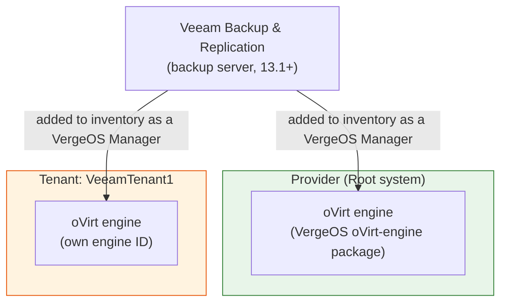

# Veeam Integration with VergeOS

## Overview

Veeam Backup & Replication (VBR) 13.1 and later includes a native VergeOS integration, letting you protect workloads running on VergeOS — both in the provider (the root system) and inside individual tenants — with Veeam's backup and recovery platform.

For the network configuration the deployed components need — including extending the provider's External network into tenants — see [Configuring Network Access for Veeam Backup & Replication Workers](https://app.gitbook.com/s/QZBMFpokMv2vWTIRbFzA/backup-dr/veeam-worker-networking) in the Knowledge Base.

## How It Works

The integration is built on the VergeOS **oVirt-engine package**, which exposes a VergeOS system through an oVirt-compatible API. In the Veeam console, you select **VergeOS** under Virtualization Platforms and add the system to the inventory as a **VergeOS Manager**. Each tenant you want to protect is added the same way, as its own VergeOS Manager with its own engine ID.

Once a VergeOS Manager is in the inventory, Veeam deploys and manages the rest itself. The main components involved:

- **Backup server** — the machine running Veeam Backup & Replication; the configuration, administration, and management core of the backup infrastructure.
- **Workers** — auxiliary Linux-based VMs that Veeam deploys on the protected system to process backup workloads and move data to and from backup repositories.
- **Backup repositories** — the storage locations where backups land.

## Installing the oVirt-engine Package

The oVirt-engine package is an optional VergeOS package (listed as "oVirt API compatibility") delivered through the standard update system:

1. From the top menu, navigate to **System** > **Updates**.
2. In the **Packages** list, locate the **ovirt-engine** package. Optional packages that aren't yet installed show *-- Optional --* in the Branch column.
3. Click the cloud download icon next to **ovirt-engine**. Once queued, its Version column reads `Not Installed→<version>`.
4. Run the update from the left menu — **Download** (if needed), then **Install**. After the install, a **Reboot** is required, just like a normal VergeOS update: nodes update one at a time with workloads migrated automatically, so there's no system downtime when adequate resources are available. See [Updating VergeOS](https://app.gitbook.com/s/pODKGSQETqL1gSqyxIq3/system-administration/running-updates) for the full update flow.

## Requirements

- **VergeOS 26.1.7 or later** — the first release whose oVirt-engine package is supported by Veeam — with the **oVirt-engine** package enabled
- **Veeam Backup & Replication 13.1 or later** — the first release with the VergeOS integration
- Review Veeam's [Considerations and Limitations](https://helpcenter.veeam.com/docs/vbr/userguide/uh_limitations.html?ver=13)  for what the integration does and doesn't support

## Documentation and Resources

- [Configuring Network Access for Veeam Backup & Replication Workers](https://app.gitbook.com/s/QZBMFpokMv2vWTIRbFzA/backup-dr/veeam-worker-networking) - Step-by-step networking guide in the VergeOS Knowledge Base, covering provider-only and tenant deployments
- [Veeam Backup & Replication User Guide — Universal Hypervisors](https://helpcenter.veeam.com/docs/vbr/userguide/universal_hypervisors.html?ver=13)  - Veeam's integration overview
- [Veeam Backup & Replication User Guide — Solution Architecture](https://helpcenter.veeam.com/docs/vbr/userguide/uh_infrastructure_components.html?ver=13)  - Veeam's component reference

## Support

If you encounter issues with the Veeam integration or have questions about implementation:

- [Veeam Support](https://www.veeam.com/support.html)  - Official support from Veeam
- [VergeOS Support](https://app.gitbook.com/s/uJc5d3O7cwI7qD8muSyG/support-and-services) - Technical assistance for VergeOS environments
