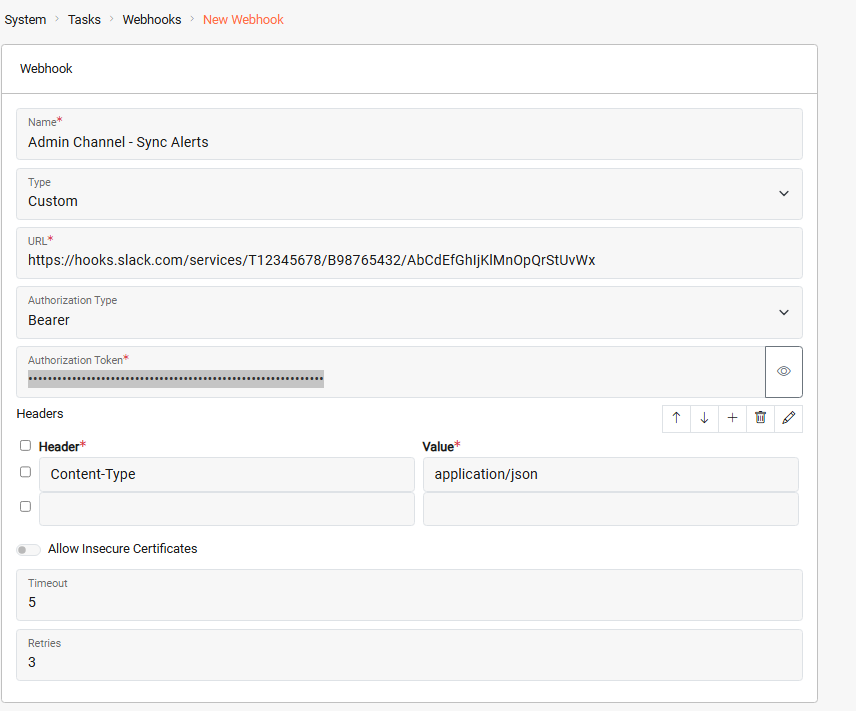
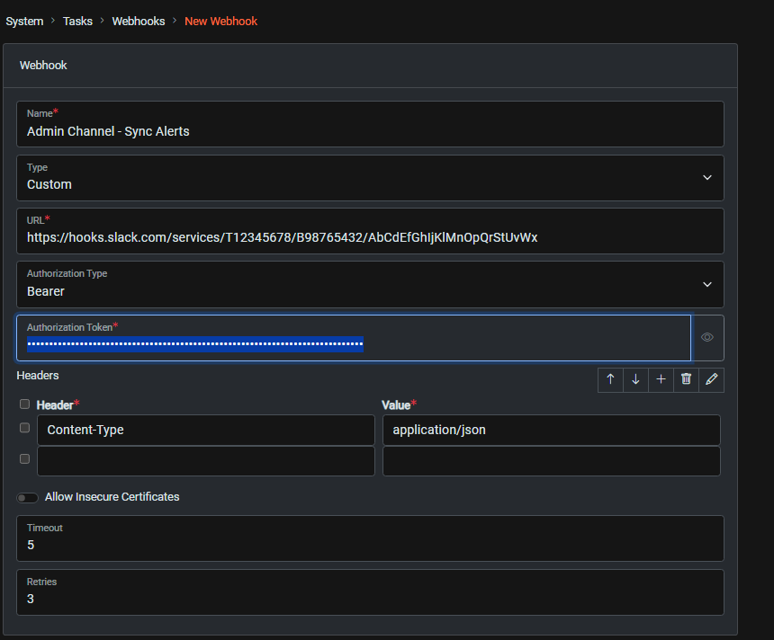
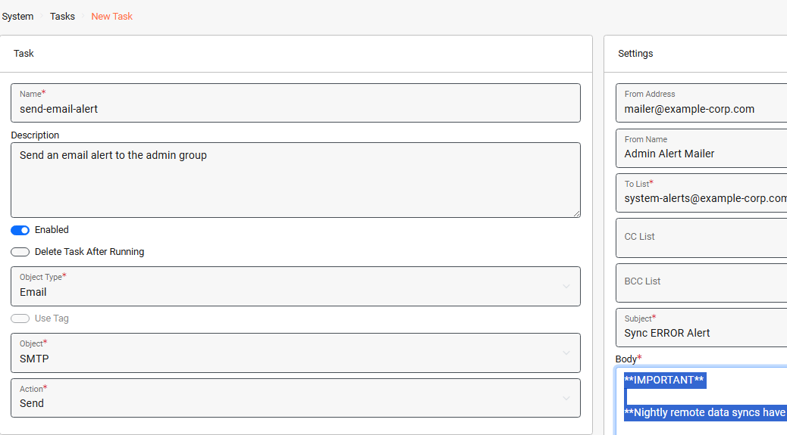
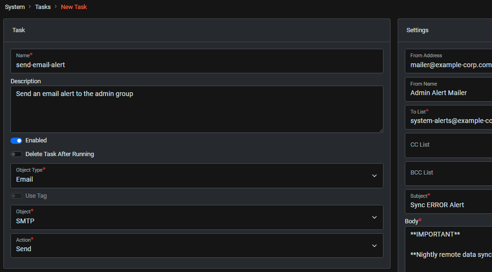
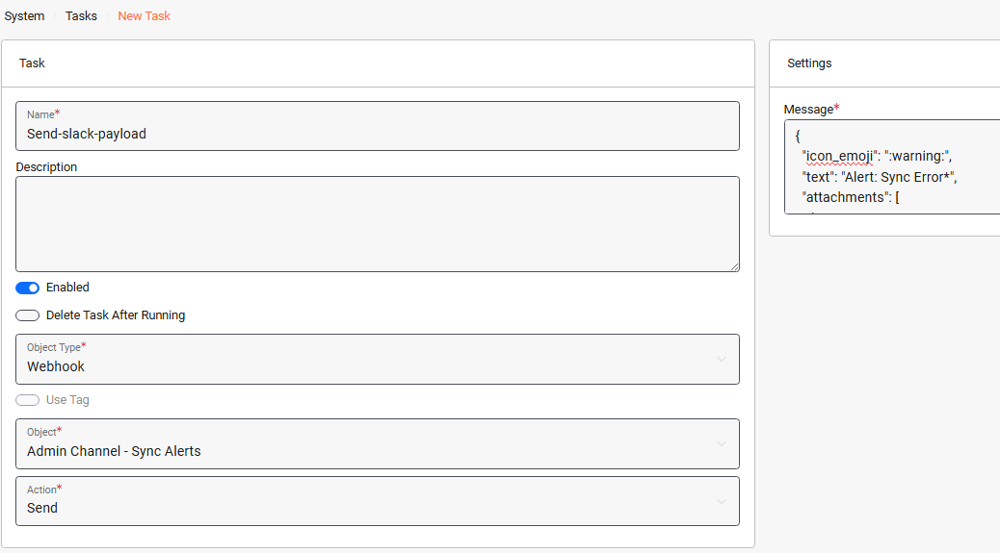
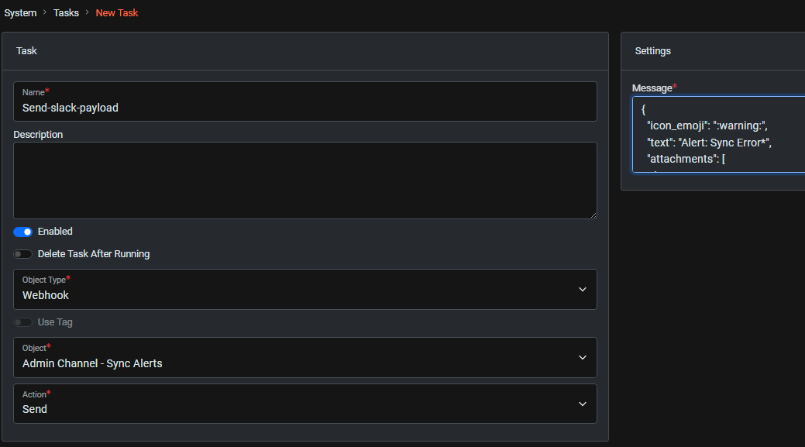
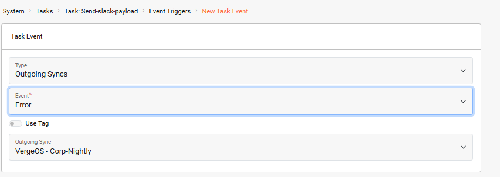
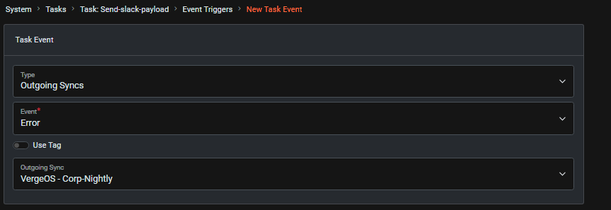
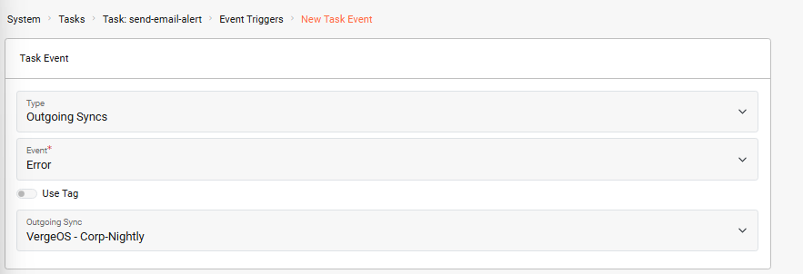
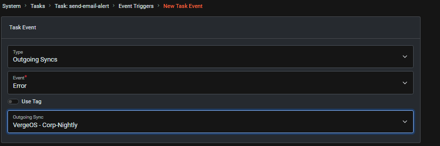

# Automated Task Example - Send Slack Channel and Email Alerts Upon a Sync Error

## Send Slack Channel Notification and Email Alert on Sync Error


**Key Points**

* The _**VergeOS Task Engine**_ allows you to automate operations, triggered by specific system conditions, events, or scheduled times. Using modular, reusable components (tasks, events, schedules, and webhooks) you can easily configure automation tailored to your environment.
* The following example demonstrates how tasks, events and webhooks work together to automatically send simultaneous alerts (Slack channel and email) in response to any error generated by a sync operation.


## Use Case

Administrators of a DR/BC service provider need to be notified immediately if a nightly sync job encounters errors. Early notification gives them time to investigate and attempt remediation, increasing the likelihood that they can reinitiate the sync and complete it within the available synchronization window.

The company uses multiple redundant alerting systems to notify administrators of critical issues: one system delivers alerts via email, while another posts messages to a dedicated Slack channel.

Using VergeOS Task Engine components, administrators can instantly trigger alerts in both systems whenever an important sync job reports errors. The automation consists of a webhook, two tasks, and an event. The steps below walk you through the full configuration:


**1. Configure the Webhook**

The webhook defines the target URL and authentication method required by the external Slack system.

_**System > Tasks Dashboard > New Webhook**_




**2. Create a Task to Send the Email**

This task defines the email alert that will be sent.

_**System > Tasks Dashboard > New Task**_




**3. Create a Task to Send the Webhook**

This task defines the message payload that will be sent to Slack via the webhook.

_**System > Tasks Dashboard > New Task**_




**4. Assign an Event Trigger to the&#x20;**_**Send-slack-payload**_**&#x20;Task**

Assigning an event trigger allows us to specify the condition (a sync error) that will fire the task.

From the _Send-slack-payload_ task dashboard: _**Event Triggers > New**_




**5. Assign an Event Trigger to the&#x20;**_**'send-email-alert'**_**&#x20;Task**

We apply the same event trigger to this task so that the email alert is also sent when there is a sync error.

_**System > Tasks Dashboard > Tasks >**_ select the _send-email-alert_ task _**> Event Triggers > New**_



This automation ensures that administrators are notified immediately when a sync job encounters an error, allowing them to act promptly, providing the best chance to resolve the issue before the synchronization window closes.


**Triggers Based on Multiple Objects**

In this example, the trigger is tied to a single outgoing sync. If you want the same trigger to apply to multiple, or even all, outgoing sync jobs, assign a shared [Tag](https://app.gitbook.com/s/pODKGSQETqL1gSqyxIq3/system-administration/tags) to those syncs. You can then configure the trigger to fire whenever any sync with that tag produces an error.


## Troubleshooting


**Common Issues**

* **Webhook not firing**: Verify the webhook URL is correct and the external service (Slack) is accessible from your VergeOS environment.
* **Email not received**: Check that SMTP settings are properly configured under System > Settings > SMTP.
* **Event trigger not activating**: Ensure the trigger is assigned to the correct sync object and the event type is set to "Error".


## Additional Resources

* [Task Engine Overview](https://app.gitbook.com/s/sppYQkyIET58BuAo0kqm/automation/task-engine)
* [Configuring Webhooks](https://app.gitbook.com/s/sppYQkyIET58BuAo0kqm/automation/webhooks)
* [Working with Tags](https://app.gitbook.com/s/pODKGSQETqL1gSqyxIq3/system-administration/tags)
* [SMTP Configuration](https://app.gitbook.com/s/pODKGSQETqL1gSqyxIq3/system-administration/smtp)

## Feedback


**Need Help?**

If you need further assistance or have any questions about this article, please don't hesitate to reach out to the [VergeOS Support Team](https://app.gitbook.com/s/uJc5d3O7cwI7qD8muSyG/support-and-services).

