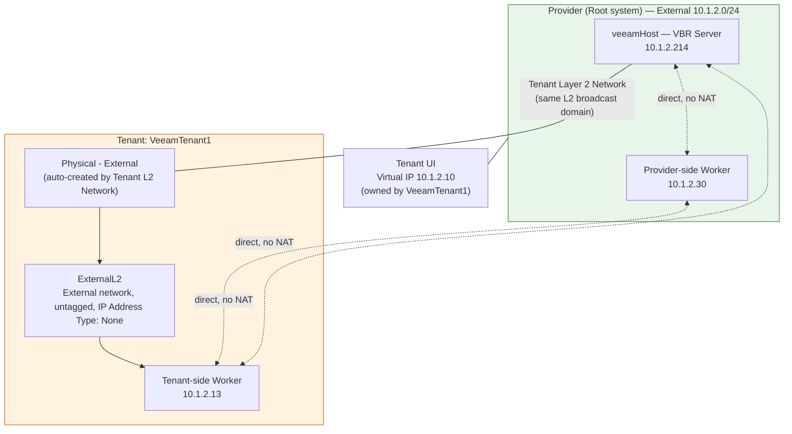

# Configuring Network Access for Veeam Backup & Replication Workers

## Overview

Veeam Backup & Replication (VBR) deploys **workers** — auxiliary Linux-based VMs that process backup workloads and move backup data — on demand. In this guide the **provider** is the root system — the top-level VergeOS system (itself the root tenant) that hosts your tenants and runs VBR. The **VBR server** (`veeamHost`) is a single VM hosting both of Veeam's core components: the **backup server** (the management core of the backup infrastructure) and a **backup repository** (the storage location where backups land). When VBR is protecting workloads both in the provider and inside a tenant, the workers it deploys on each side need to reach each other — and the VBR server, where the backup repository lives — directly, without being blocked by tenant NAT or routed through extra hops.

The integration itself — the VergeOS oVirt-engine package, adding systems and tenants to Veeam as **VergeOS Managers**, and version requirements — is covered in [Veeam Integration with VergeOS](https://app.gitbook.com/s/sppYQkyIET58BuAo0kqm/tools-integrations/veeam). This guide covers only the *networking* the workers need: the **data path** shown in the [Example Topology](#example-topology) below — the flat External network the workers use to move backup traffic once they're deployed.

The underlying model is simple:

- **Provider workloads only:** attach both the VBR server and its worker directly to the provider's `External` network. That's the whole setup — everything already shares one Layer 2 domain, so the VBR server and worker reach each other directly with no manually-created firewall rules.
- **Tenant workloads:** extend that same `External` network into each tenant at Layer 2, then deploy a worker inside the tenant on the extended network. This is the easiest route to tenant backup — it gives every component the access it needs without hand-crafting firewall rules.

This flat, shared-Layer-2 design is deliberately the simplest way to get Veeam up and running on VergeOS. If your environment needs stronger tenant isolation or a dedicated backup network, see [More Complex Deployments](#more-complex-deployments) at the end of this guide.

This guide walks through the full tenant case, which puts the provider's VBR server and both workers on the **same Layer 2 broadcast domain** while still exposing the tenant's UI on that same network. It uses VergeOS's [Tenant Layer 2 Networks](https://app.gitbook.com/s/pODKGSQETqL1gSqyxIq3/tenants/layer-2-networks) feature to bridge a tenant directly onto the provider's `External` network, rather than routing tenant traffic through NAT. For the provider-only case, see [Provider-Only Deployment](#provider-only-deployment-no-tenants) below.


**Key Points**

- The provider's `External` network is passed straight through to the tenant using a Tenant Layer 2 Network — no VLAN tagging is required if you're passing the primary/flat External network.
- Because every component sits on the same External Layer 2 domain, **no firewall rules need to be created manually** — the flat network gives the VBR server and workers the access they need.
- VBR assigns worker IP addresses itself when it deploys each worker. These are **not** managed by VergeOS DHCP — pick addresses outside your External network's DHCP range.
- The tenant still gets its own routable UI address via a **Virtual IP**, independent of the Layer 2 pass-through.


## Provider-Only Deployment (No Tenants)

If you're only protecting workloads in the provider (the root system) and no tenants are involved, this collapses to a much simpler setup — just leave the tenant parts out:

1. Attach the **VBR server** to the provider's `External` network with a static IP (see [Step 1](#step-1-deploy-the-vbr-server-on-the-providers-external-network)).
2. Deploy the **provider-side worker** on that same `External` network with a static IP outside the DHCP range (see [Step 5](#step-5-deploy-the-workers)).

That's it. Steps 2–4 exist only to extend the External network into a tenant, so you can skip them entirely. Everything already shares the External network's Layer 2 domain, so the VBR server and worker communicate directly with no manually-created firewall rules.

When tenants are later added to the picture, extend the same `External` network into each one with a Tenant Layer 2 Network and deploy a worker there — that's the tenant workflow documented in the rest of this guide.

## Example Topology

| Role | Location | Network | Example IP |
|------|----------|---------|------------|
| VBR server (`veeamHost`) | Provider | `External` | `10.1.2.214` (static) |
| Tenant UI | Provider-assigned | `External` (Virtual IP owned by tenant) | `10.1.2.10` |
| Provider-side worker | Provider | `External` | `10.1.2.30` (static, set by VBR) |
| Tenant-side worker | Tenant (`VeeamTenant1`) | `ExternalL2` | `10.1.2.13` (static, set by VBR) |

Because everything sits on the same subnet, the VBR server and both workers can talk to each other directly, and the tenant admin UI stays reachable at its own IP on that same network — no port-forwarding or extra routes to maintain.

## Requirements

**Always:**

- The [Veeam integration with VergeOS](https://app.gitbook.com/s/sppYQkyIET58BuAo0kqm/tools-integrations/veeam) in place — version requirements met, the oVirt-engine package enabled, and the system added to the Veeam inventory as a **VergeOS Manager**
- Cluster Admin access at the provider level
- The provider's `External` network already configured and running
- Veeam Backup & Replication deployed as a VM on the provider — in this guide a single **VBR server** hosting both the backup server and a backup repository
- Review Veeam's [Considerations and Limitations](https://helpcenter.veeam.com/docs/vbr/userguide/ovirt_limitations_rhv.html?ver=13) for what the integration does and doesn't support before planning your deployment

**Tenant path only:**

- An existing tenant (this guide uses `VeeamTenant1` as an example), added to Veeam as its own VergeOS Manager

## Step 1: Deploy the VBR Server on the Provider's External Network

Deploy your Veeam Backup & Replication server as a VM with a NIC attached directly to the provider's `External` network, and give it a static IP in that subnet (e.g. `10.1.2.214`).


This VM is standard VergeOS VM configuration — no special networking is required here. It just needs to sit on the same `External` network you'll be bridging to the tenant in the next steps.


## Step 2: Assign the Tenant a UI Virtual IP on the External Network

This keeps the tenant's admin UI reachable on the same network as the VBR server, independent of the Layer 2 pass-through configured later.

1. Navigate to the provider's **External** network dashboard.
2. Click **IP Addresses** in the left menu, then **New**.
3. **Type**: `Virtual IP`
4. **IP Address**: the address you want the tenant UI to use (e.g. `10.1.2.10`)
5. **Owner Type**: `tenant`
6. **Owner**: select your tenant (e.g. `VeeamTenant1`)
7. Click **Submit**.
8. From the **External** network dashboard, click **Apply Rules**.
9. Navigate to the tenant's network dashboard (**Networks** > **Dashboard** > **Tenants** > double-click the tenant) and click **Apply Rules** there as well.

Full details: [Assigning External IP Addresses to a Tenant](https://app.gitbook.com/s/pODKGSQETqL1gSqyxIq3/tenants/assign-ip-to-tenant).

## Step 3: Create the Tenant Layer 2 Network Connection

This bridges the tenant directly onto the provider's `External` network at Layer 2.

1. From the top menu, navigate to **Tenants** > **List**.
2. Click the tenant name (e.g. `VeeamTenant1`) to open the tenant dashboard.
3. In the left navigation, expand **Network** and click **Layer2 Networks**.
4. Click **New**.
5. **Network**: select the provider's `External` network.
6. Toggle **Enabled** to ON (blue).
7. Click **Submit**.

VergeOS automatically provisions a NIC on the tenant's node connected to `External`, plus a **Physical - External** network inside the tenant that plugs into it.


**Do Not Tag the Auto-Created Network**

If VergeOS auto-creates a matching External network inside the tenant, leave it untagged — the interface is already on the correct network. See [Configure Tenant Layer 2 Networks](https://app.gitbook.com/s/pODKGSQETqL1gSqyxIq3/tenants/layer-2-networks) for the full explanation of the auto-created components.


Full details and removal/cleanup steps: [Configure Tenant Layer 2 Networks](https://app.gitbook.com/s/pODKGSQETqL1gSqyxIq3/tenants/layer-2-networks).

## Step 4: Create the Tenant-Side External Network for Worker Attachment

If your tenant already has its own default network named `External` (used for normal outbound/NAT access), VergeOS won't create a second network with that same name — so you'll add one manually on top of the auto-created `Physical - External` backend network, under a different name (this example uses `ExternalL2`).

1. Log into the **tenant UI**.
2. Navigate to **Networks** > **New External**.
3. **Name**: `ExternalL2`
4. **Layer 2 Type**: `None` (this is a plain passthrough — the VLAN/tagging, if any, is already handled by the Physical - External interface)
5. **Interface Network**: `Physical - External`
6. **IP Address Type**: `None`


**Why IP Address Type: None**

Veeam assigns and manages the worker's IP address itself when it deploys the worker VM. Leaving IP Address Type at `None` keeps VergeOS out of the way of that addressing — it's a pure Layer 2 passthrough, matching how [internal Layer 2 networks](https://app.gitbook.com/s/pODKGSQETqL1gSqyxIq3/networks/internal-layer2) work when a third party manages IP addressing.


7. Click **Submit**, then **Power On** the network.

For the full field reference on external network creation (VLAN options, static IP, routing rules), see [How to Create an External Network](../networking/create-external-network.md).

## Step 5: Deploy the Workers

Deploy the workers from within Veeam using its VergeOS integration — VergeOS needs no extra configuration here beyond the networks created above. Refer to [Veeam's documentation](https://helpcenter.veeam.com/docs/vbr/userguide/ovirt_overview.html?ver=13) for the exact worker deployment steps for your Veeam version.

- **Provider-side worker**: attach to the provider's `External` network. Give it a static IP outside your External network's DHCP range (in this example, the External network hands out `10.1.2.200`–`10.1.2.201` via DHCP, so `10.1.2.30` is a safe static choice).
- **Tenant-side worker**: attach to the tenant's `ExternalL2` network. Again, use a static IP outside the provider's DHCP range (e.g. `10.1.2.13`).


**Avoid DHCP Range Conflicts**

Because these are static addresses set inside the Veeam worker (not requested from VergeOS DHCP), double-check they don't collide with the External network's DHCP scope or any other statically-assigned addresses on that subnet.


Once both workers are up, they and the VBR server should all be able to reach each other directly on `10.1.2.0/24`, and the tenant UI stays reachable at its Virtual IP (`10.1.2.10`) on the same network.

## Verification

- From the VBR server, confirm both workers show as reachable/healthy in the Veeam console.
- From each worker, confirm it can reach the VBR server and the other worker directly (e.g. `ping`) without needing a route through the tenant's NAT gateway.
- Confirm the tenant admin UI is reachable at its Virtual IP from the same network as the VBR server.
- In the tenant UI, under **Networks** > **List**, confirm `Physical - External` and `ExternalL2` are both present and running.

## Troubleshooting


**Common Issues**

- **Worker can't reach the VBR server or the other worker**: confirm `ExternalL2` (tenant-side) is powered on and its **Interface Network** is `Physical - External`, not the tenant's own default `External` network.
- **Tenant UI unreachable at its Virtual IP**: confirm **Apply Rules** was run on both the provider's `External` network and the tenant's network dashboard after assigning the Virtual IP.
- **Naming collision when creating the Layer 2 Network**: if VergeOS doesn't appear to create a matching `External` network inside the tenant, it's likely because the tenant already has a default network with that name. Create the worker-facing network manually (Step 4) under a different name, using `Physical - External` as its interface.
- **Worker IP conflicts**: verify the static IP set inside the Veeam worker doesn't fall inside the External network's DHCP range or collide with another static/virtual IP already in use on that subnet.


## More Complex Deployments

The topology in this guide is intended to get Veeam up and running quickly — one flat Layer 2 domain, no firewall rules — and works well for labs, proofs of concept, and smaller production environments. Larger or more security-sensitive environments may call for:

- **A dedicated backup network.** Instead of extending the primary `External` network, create a separate VLAN for backup traffic and pass it into each tenant as a VLAN-tagged [Tenant Layer 2 Network](https://app.gitbook.com/s/pODKGSQETqL1gSqyxIq3/tenants/layer-2-networks). This keeps backup data off your production network and lets you shape or limit that traffic independently.
- **Routed access with explicit firewall rules.** If extending a shared Layer 2 domain into tenants isn't acceptable — for example, strict tenant isolation requirements — keep each tenant behind its own routed/NATed networks and create firewall rules for the specific ports Veeam needs between the VBR server, workers, and repositories. See [Ports](https://helpcenter.veeam.com/docs/vbr/userguide/used_ports.html?ver=13) in the Veeam User Guide for the full list. This gives you the tightest control at the cost of more rule maintenance per tenant.
- **Scaled-out Veeam infrastructure.** As backup volume grows, Veeam supports moving beyond the all-in-one VBR server — dedicated backup repositories, gateway servers, and additional workers. That sizing is a Veeam-side design decision; see the [Veeam Backup & Replication User Guide](https://helpcenter.veeam.com/docs/vbr/userguide/ovirt_overview.html?ver=13). The networking principle from this guide still applies: every worker needs direct reachability to the components it moves data between.

## Related Documentation

- [Veeam Integration with VergeOS](https://app.gitbook.com/s/sppYQkyIET58BuAo0kqm/tools-integrations/veeam)
- [Configure Tenant Layer 2 Networks](https://app.gitbook.com/s/pODKGSQETqL1gSqyxIq3/tenants/layer-2-networks)
- [Assigning External IP Addresses to a Tenant](https://app.gitbook.com/s/pODKGSQETqL1gSqyxIq3/tenants/assign-ip-to-tenant)
- [How to Create an External Network](../networking/create-external-network.md)
- [Creating an Internal Layer 2 Network](https://app.gitbook.com/s/pODKGSQETqL1gSqyxIq3/networks/internal-layer2)
- [Tenant Overview](https://app.gitbook.com/s/pODKGSQETqL1gSqyxIq3/tenants/overview)
- [Veeam Backup & Replication User Guide — oVirt KVM Integration](https://helpcenter.veeam.com/docs/vbr/userguide/ovirt_overview.html?ver=13)
- [Veeam Backup & Replication User Guide — Considerations and Limitations](https://helpcenter.veeam.com/docs/vbr/userguide/ovirt_limitations_rhv.html?ver=13)
