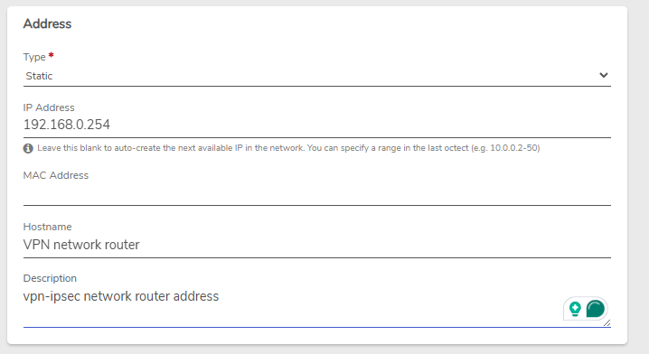
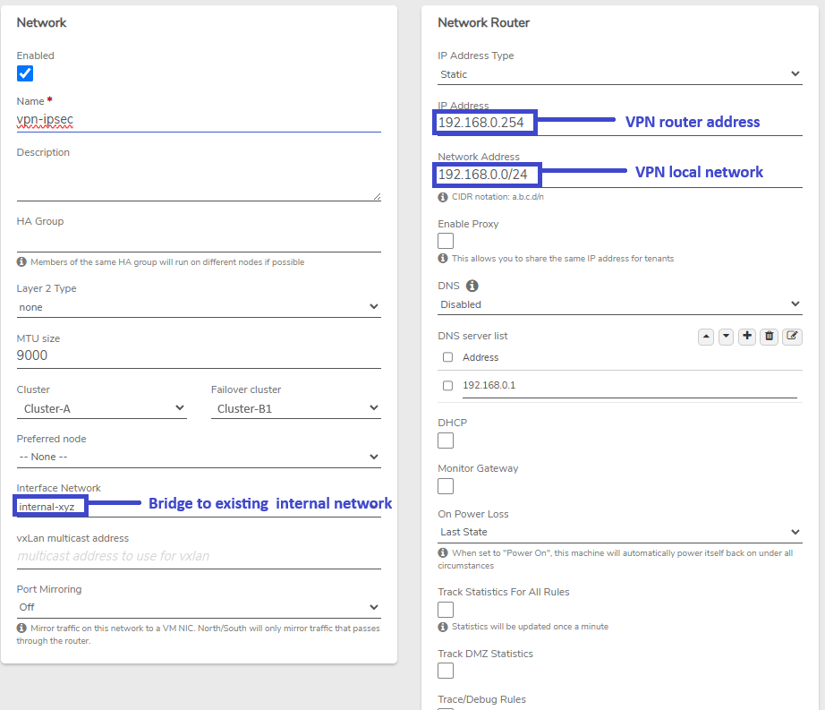
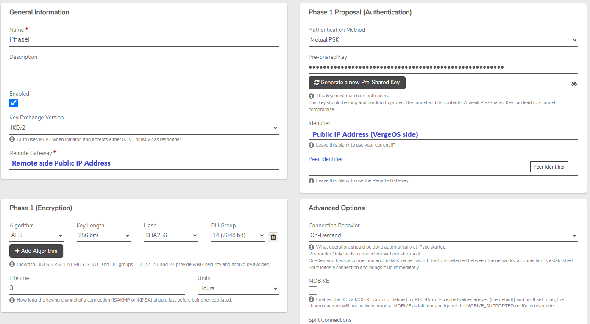
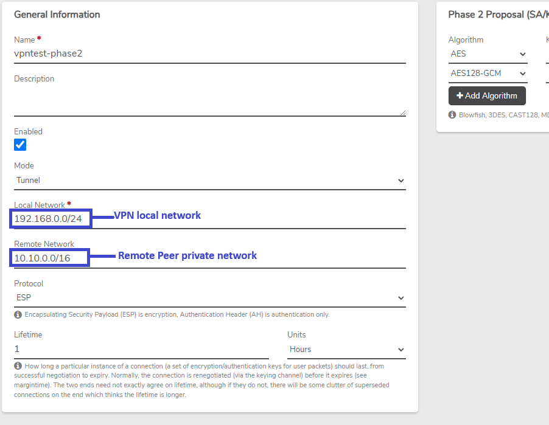
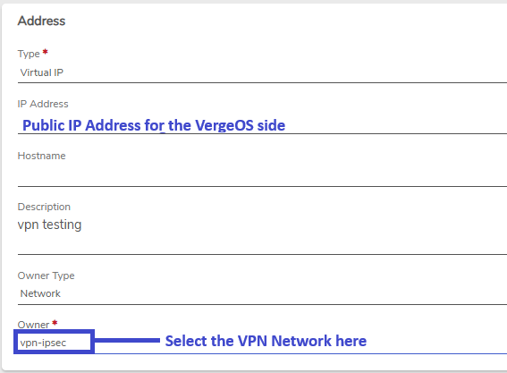
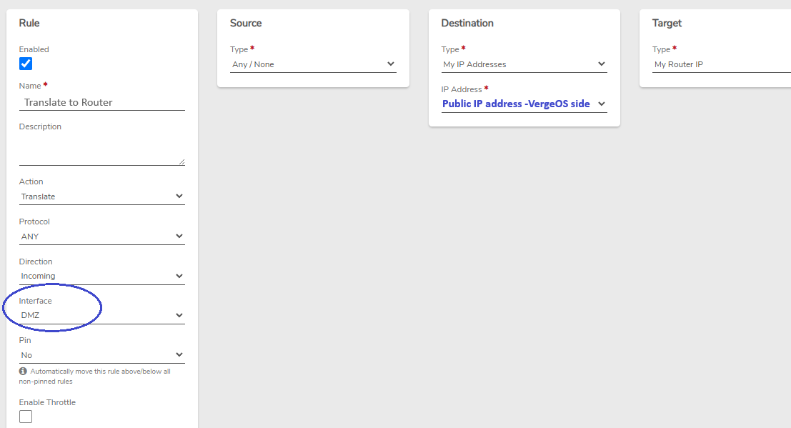
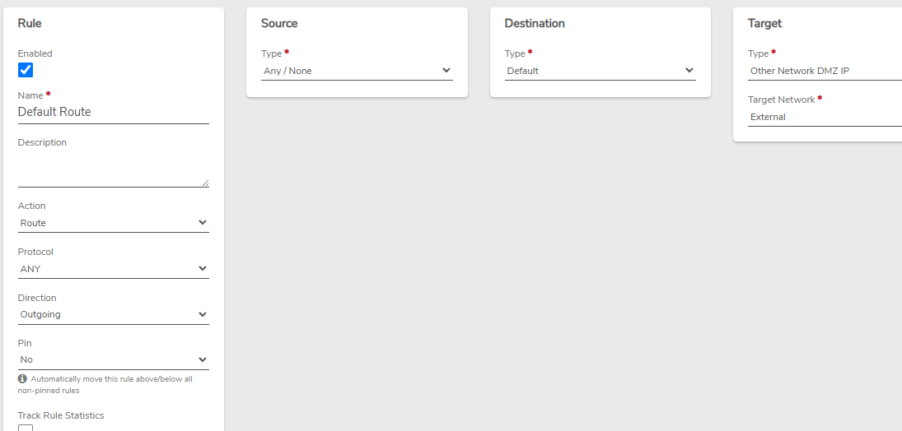
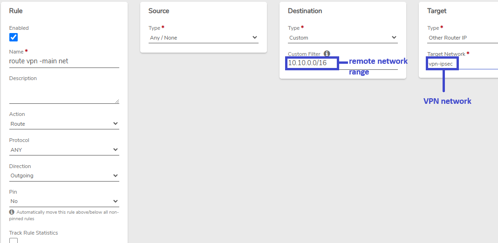

# IPsec Example - Dedicated Public IP

The following IPsec example utilizes a dedicated public IP address for a VPN tunnel. The VPN router is bridged to an existing internal network to provide Layer 2-connectivity to that network.


**IPsec is a complex framework that supports a vast array of configuration combinations with many ways to achieve the same goal, making it impossible to provide one-size-fits-all instructions. Sample configurations are given for reference and should be tailored to meet the particular environment and requirements.**



**Consult the** [**IPsec Product Guide Page**](https://app.gitbook.com/s/pODKGSQETqL1gSqyxIq3/vpn/ipsec) **for step-by-step general instructions on creating an IPsec tunnel.**


* **VPN Network Name:** _vpn-ipsec_
* **VPN Router address:** _192.168.0.254_
* **Local VPN network:** _192.168.0.0/24_
* **Remote VPN network:** _10.10.0.0/16_
* **Bridged Internal Network Name:** _Internal-xyz_
* **External Network Name:** _External_

## Static Lease

We navigate to _**Internal-xyz** > IP Addresses > New_\* to reserve a static address for the VPN router on this internal network in order avoiding another entity from taking the same IP address. Full instructions for creating a static lease can be found here: [Create a DHCP Static Lease](https://app.gitbook.com/s/pODKGSQETqL1gSqyxIq3/networking/dhcp-static-lease).

## VPN Network Configuration

## Phase 1

## Phase 2

## Assigned Public IP Address

The public address must be [Assigned from the External network](https://app.gitbook.com/s/pODKGSQETqL1gSqyxIq3/networking/assign-external-ip) to the VPN network.

## Default VPN Network Rules

**Default Firewall Rules** - The following necessary firewall rules are **created automatically** when a VPN network is created:

* **Allow IKE**: Accept incoming UDP traffic on port 500 to **My Router IP**
* **Allow IPsec NAT-Traversal**: Accept incoming UDP traffic on port 4500 to **My Router IP**
* **Allow ESP**: Accept incoming ESP protocol traffic to **My Router IP**
* **Allow AH**: Accept incoming AH protocol traffic to **My Router IP**


**These rules can be modified to restrict to specific source addresses, where appropriate.**


## Additional VPN Network Rules

Additional rules need to be created on our new VPN network:

**Translate Rule:** 


**The translate rule must be moved to the top of the rules list, before the&#x20;**_**Accept**_**&#x20;Rules. Instructions for changing the order of rules can be found in the Product Guide:** [**Network Rules - Change the Order of Rules**](https://app.gitbook.com/s/pODKGSQETqL1gSqyxIq3/networking/network-rules#change-the-order-of-rules)


**Default Route Rule:** 

## Internal Network Rule

A routing rule is needed on _Internal-xyz_ to route its VPN traffic to the VPN network.


**New rules must be applied on each network to put them into effect.**

