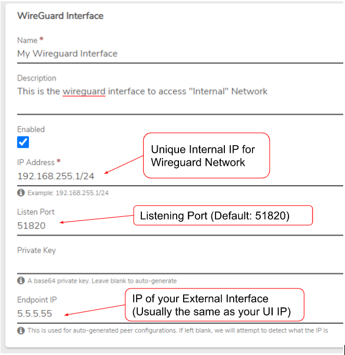
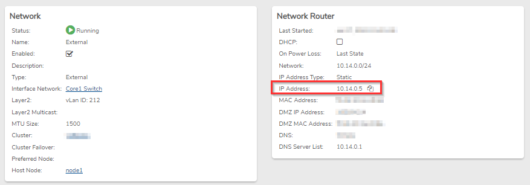
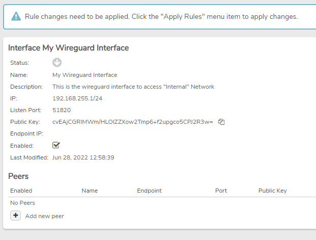
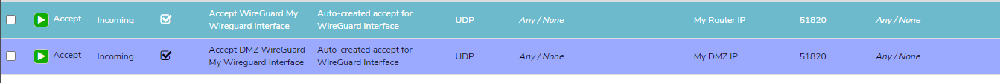
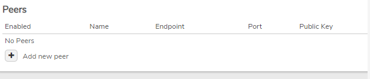

# Wireguard - Setup Remote Access VPN

Here are instructions on how to set up a Remote Access VPN using the built-in Wireguard capabilities of VergeOS. More information can be found in the Help section of the VergeOS User Interface.

## Create the Wireguard Setup on Your Internal Network


**You can use an existing Internal Network or create a new Internal Network.**


1. In the Verge OS UI, navigate to **Networks -> Internals** and view or **double-click** on the Internal Network that you want to use.
2. In the left menu, click on **Wireguard (VPN)**.
3. Click on **Add New Interface**. 
4. Enter the following information:
   * Enter a unique **Name** for this interface.
   * Enter a **Description** (optional).
   * Check **Enabled**.
   * Enter the **IP Address** to be used for this Wireguard Internal Network. This **must be** separate from your existing Internal network IP scheme. For example, if your Internal Network is using 192.168.0.1/24, you must choose a different unique IP scheme like 192.168.255.1/24.
   * Enter the **Listen Port** to be used when connecting to the VPN (**Default: 51820**). This is the port that you will use on your External network to send VPN traffic into your Internal Network.
   * Enter a **Private Key** or leave it blank to auto-generate a key.
   * Enter an **Endpoint IP** or leave it blank, and the system will attempt to auto-detect the IP. We **highly recommend** you enter the IP manually to ensure the correct config. This IP is the external IP of your environment, usually the same IP as your UI. You can find your External IP by going to **Networks -> Externals** and viewing your External network. In the Network Router section, it should be the IP address as shown below: 
5. Click **Submit** to add the new interface.
6. After adding the interface, it will take you to the dashboard where you will see your new interface.\
   
7. Click **Apply Rules** on the left menu bar to apply the firewall rules. The rules automatically created will accept inbound UDP traffic on port 51820 to both the Router IP and the DMZ IP of the **Internal Network**. 

## External Network PAT Rule

In order for the internal network to be connected, we need an external **PAT** (Port Address Translation) rule to translate the port (**default 51820**) to the **internal network**.

### Add External PAT Rule

1. From the **External network** Dashboard, click **Rules** on the left menu.
2. Click **New** on the left menu.
3. Enter a _**Name**_ that will be helpful to future administration.
4. **Optionally**, a _**Description**_ can be entered to record additional administrative information.
5. In the _**Action**_ dropdown, select **Translate**.
6. In the _**Protocol**_ dropdown, select **UDP**.
7. In the _**Direction**_ dropdown, select **Incoming**.

**Source:**

8. In the _**Type**_ dropdown, select **Any/None**. **Optionally**, you can source-lock the VPN traffic here if needed.

**Destination:**

9. In the _**Type**_ dropdown, select **My Router IP**. If you are inside a **Tenant**, change this to **My IP Addresses** and choose the IP of the **Tenant UI**. This should be the same as the **Endpoint IP** used above. If using a different IP than the UI IP, create an **SNAT** rule on the **External** network.
10. In the _**Destination Ports/Ranges**_ field, enter the **Port** (Default Port: 51820).

**Target:**

11. In the _**Type**_ dropdown, select **Other Network DMZ IP**.
12. In the _**Target Network**_ dropdown, select the **Target Network**.
13. Leave the _**Target Ports/Ranges**_ field blank.
14. Click **Submit** and **Apply Rules** on the left menu to put the new rule into effect.

## SNAT Rule (if not using UI IP)

If you are adding **Wireguard** and are not using the IP address of the **UI**, we recommend creating an **SNAT** rule on the **External** network.

1. From the **External network** Dashboard, click **Rules** on the left menu.
2. Click **New** on the left menu.
3. Enter a _**Name**_ that will be helpful to future administration.
4. **Optionally**, enter a _**Description**_ for additional information.
5. In the _**Action**_ dropdown, select **Translate**.
6. In the _**Protocol**_ dropdown, select **UDP**.
7. In the _**Direction**_ dropdown, select **Outgoing**.

**Source:**

8. In the _**Type**_ dropdown, select **Other Network DMZ IP**.
9. In the _**Network**_ dropdown, select the Internal Network that Wireguard is on.
10. Leave the _**Source Ports/Ranges**_ field blank.

**Destination:**

11. In the _**Type**_ dropdown, select **Any / None**.
12. Leave the _**Destination Ports/Ranges**_ field blank.

**Target:**

13. In the _**Type**_ dropdown, select **My IP Addresses**.
14. In the _**IP Address**_ dropdown, select the **IP address** you want to use.
15. Click **Submit** and **Apply Rules** to enable the SNAT rule.


**This SNAT rule forces any outgoing traffic from the DMZ IP of the internal network to use the correct IP. By default, it goes out the UI IP, causing flapping issues.**


## Adding a Remote User Peer


**You will set up a Peer for each user connecting to the VPN.**


1. From the Wireguard Interface screen, click **Add new peer**. 
2. Assign a **Name** to the peer, such as the remote user's name.
3. Optionally, enter a **Description**.
4. Check the **Auto-Generate Peer Configuration** checkbox.
5. Enter the **Endpoint** for the Peer (the external-facing IP address, hostname, or URL).
6. For **Allowed IPs**, enter the /32 IP for this peer.
7. In the **Configure Firewall** dropdown, select **Remote User**.
8. Click **Submit** to save the peer entry. 

### Download the Configuration File:

9.  Click the **Download Config** button on the peer record and download the file.

    .png>) .png>)

### Install WireGuard Software on Client:

WireGuard client software can be downloaded from: [https://wireguard.com/install](https://wireguard.com/install).

1. Install WireGuard on the client machine.
2. Click **Add Tunnel**.
3. Navigate to and select the generated configuration file.
4. Click the **Activate** button to open the tunnel. .png>)

***


**Document Information**

* Last Updated: 2024-08-29
* vergeOS Version: 4.11

