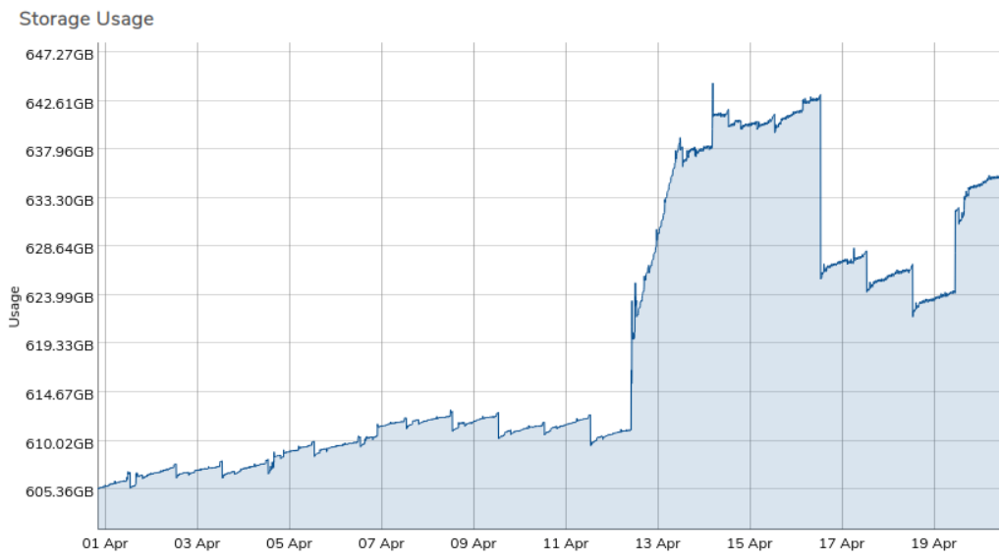

# Understanding and Explaining Unexpected vSAN Growth

There are several reasons for the vSAN to start growing at a rate faster than anticipated. Administrators should first determine when the unexplained growth occurred by reviewing the vSAN Tiers' growth history, and then assess potential areas for unexpected growth.

## Review vSAN Tiers for Growth History

To isolate unexplained growth, it is important to narrow down when the growth increased exponentially. Using the steps below, administrators can review storage growth and visualize normal growth from daily operations versus spikes in growth, which are typically unexpected.

1. Navigate to **Infrastructure** > **vSAN Tiers** from the top menu. If vSAN Tiers is not present, then this environment is a tenant of a parent system, and the vSAN tier needs to be examined at the parent system.
2. Open the vSAN Tier with unexpected growth (for example, vSAN Tier 0).
3. On the left navigation menu, click on **History**.
4. A new menu will appear showing history in various graphs. Modify the filter period to isolate any growth on this tier.
   * It is recommended to start with a custom filter of 1 day and review the **Storage Usage** graph.

### Things to Note:

* If you see dips and spikes every hour or once a day, this is likely the result of snapshots falling out of retention (old ones expiring, new ones being created). Note whether the total storage consumed at the start of the day is nearly equivalent to the end of the day. If so, expand the custom filter to a week.
* When reviewing by week, check if the total storage consumed at the start of the week is similar to the end. If, for example, the growth is roughly 10%, repeat for the previous week. If the weekly growth percentage is consistent, this represents your average weekly growth rate, which can help plan for hardware expansion.
* Filter the current month and check for any sudden spikes in storage consumption on the **Storage Usage** graph. Click and drag over the time in question to zoom in on the data, and hover over the graph for specific date/time information.

## Possible Reasons for Storage Increase

Several areas in the VergeOS platform may contribute to unexpected storage growth. Common areas to check include:

* **System Snapshots**:
  * Navigate to **System > System Snapshots**.
  * Are any being held past their expected expiration time?
  * Are there snapshots without a Snapshot Profile? These may have been taken manually. Investigate when and why they were taken.
  * Are any snapshots set to "Never Expire"? This can lead to large data consumption over time.
* **Virtual Machines (VMs) Snapshots**:
  * Navigate to the **Machines Dashboard**. The **Snapshots** count box shows the number of machine-level snapshots present. Click this box to list all VM snapshots and their creation date/time. Review if any can be removed.
  * Navigate to **Virtual Machines > List**. Sort by the **Snapshot Profile** column to identify VMs with machine-level snapshots. Virtual Machines can be restored from system snapshots, so review whether individual snapshots are necessary or if they can be removed.
* **VMWare Backup Jobs**:
  * Navigate to **Backup/DR > VMware Services** and review each VMware Service instance for Backup Job history.
  * On the left menu, click **Backup Jobs** to review each specific instance. Check the **Expires** column for each backup and review if it can be removed.
* **Files**:
  * Navigate to **Files** and sort by **Modified**. Check if any upload dates/times match the unexplained growth period.
  * Review whether any files, especially other hypervisor formats (e.g., .ova or .vhdx), can be removed.
* **Incoming Site Syncs**:
  * Navigate to **Backup/DR > Incoming Syncs**. Open each Incoming Sync dashboard and check the **Received Snapshots** count. Investigate the source (origin) site for increased storage matching the timeframe.
* **Tenant Storage**:
  * Navigate to **Tenants > Each Tenant Dashboard**.
  * Review **Total Storage Used** by clicking on **History** in the left menu. Follow the same process listed above to review growth history.
  * If unexpected growth is found, investigate within the tenant for the possible causes of storage increase (as listed above), and within any sub-tenants if applicable.

## Tier Storage Used vs. Sum of Machine Drives
A vSAN tier’s total storage used metric will typically be higher than the sum of the used space reported across its individual machine_drives.
This variance occurs because the reported used capacity of each machine drive reflects only currently referenced active blocks on those drives. In contrast, total tier usage accounts for all underlying data blocks across the platform, including:

* **Snapshots:** Blocks retained solely to preserve historical point-in-time states.
* **VMware Services:** Data retained by VMware backup instances.
* **Files:** Shared file system storage, uploaded media, or hypervisor images (e.g., .ova, .vhdx).
* **AI Models:** Localized model files and weights residing on the tier.

### Snapshot Retention
When other consumers (VMware services, AI models, and Files) have been ruled out, snapshot retention is almost always the primary contributor to unexpected tier usage. Because snapshots preserve modified or deleted blocks that are no longer referenced by active machine drives, aggressive snapshot schedules or long retention policies can dramatically expand tier consumption.


**Exercise Caution Before Deleting System Snapshots**
Before manually removing system snapshots to reclaim local storage, verify whether any pending snapshots are queued or actively synchronizing offsite to a disaster recovery target:

- If offsite sync is essential: Verify that the snapshot has completed synchronization to the remote target before deleting it locally. Deleting a snapshot mid-sync will abort the transfer; the snapshot is not made available on the remote site until its full synchronization has finished. 
- If local storage is critically low: Immediate capacity recovery may take priority over pending sync jobs to keep workloads running. Evaluate your current local tier headroom against offsite recovery requirements before making a bulk deletion.


