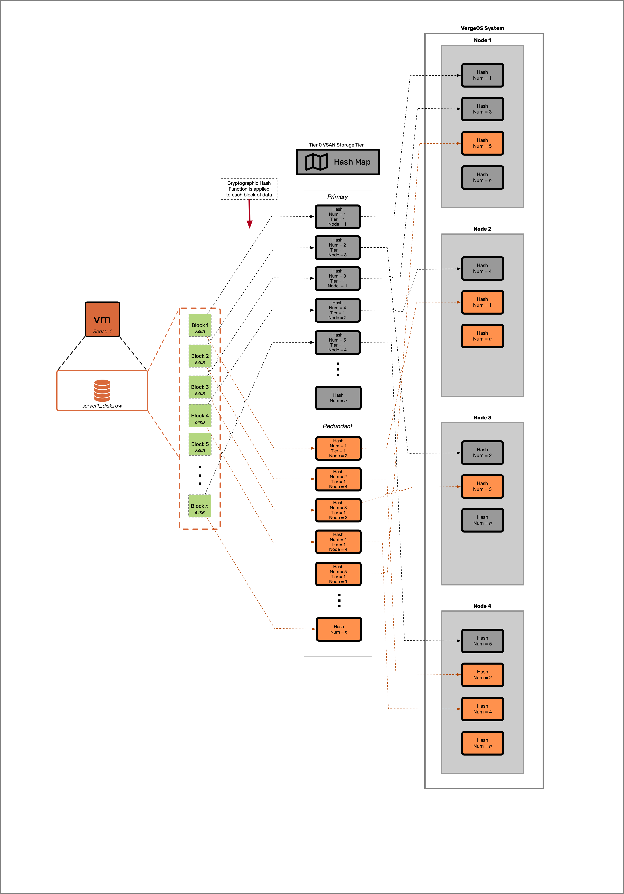
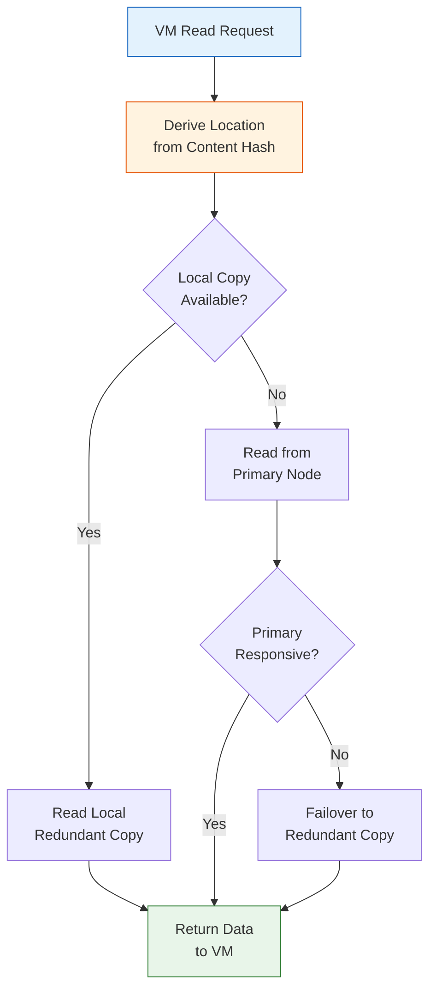
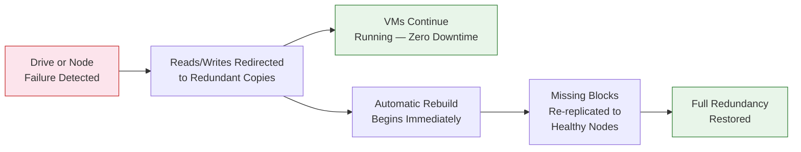

# vSAN Architecture & VergeFS

## VergeFS: Integrated Storage Service

Module 1 introduced vSAN concepts at a high level. This page goes deeper into the internal architecture — how blocks are hashed and distributed, how reads and writes flow through the system, and how features like deduplication, encryption, and snapshots are implemented at the block level.

## Block-Level Architecture

At the heart of VergeFS is a **block-level storage engine**. Every piece of data written to the vSAN — whether it is a VM disk, a snapshot, an ISO image, or system metadata — is divided into **data blocks**. Each block is assigned a **SHA-1 content hash** that serves as its unique identifier throughout the system. SHA-1 is used here for content addressing and distribution, not cryptographic security.

This hash is the foundation for nearly every vSAN feature:

- **Distribution** — The hash determines which nodes store the block's primary and redundant copies
- **Deduplication** — Identical blocks produce identical hashes, so only one copy is stored
- **Integrity** — The hash validates block contents, enabling continuous bit-rot detection
- **Location derivation** — The hash, combined with the per-tier device maps on Tier 0, deterministically derives each block's physical location

### The Hash Map and Tier 0

Block placement in vSAN is **derived from the SHA-1 content hash** combined with per-tier device maps stored on **Tier 0** drives (high-endurance NVMe SSDs):

- Each tier maintains a `0.map` (primary copy device map) and `1.map` (secondary copy device map)
- The SHA-1 hash is used as input to deterministic placement math against those maps — there is no central table recording "block X lives on node Y, drive Z"
- Reference counts are **not** stored persistently in a hash map — they are rebuilt by the differential **vSAN Walk** as it traverses live hashes
- The Tier 0 filesystem index and per-tier device maps are what Tier 0 actually holds, along with vSAN metadata

**Tier 0 is exclusively a metadata tier.** It stores the vSAN filesystem index and per-tier device maps. It is **not** a performance cache, and it does **not** store workload data. Because vSAN metadata operations depend on Tier 0, the performance of your Tier 0 drives directly impacts overall system responsiveness.


**Tier 0 is Metadata Only**

Tier 0 does **not** function as a performance cache or hot-data tier. It stores only the vSAN filesystem index and per-tier device maps. Workload data resides on Tiers 1–5. Always use enterprise NVMe drives rated for 3 DWPD or equivalent for Tier 0 and maintain at least 30% free space.


### How the Hash Map Works

The following diagram illustrates how VM data flows through the vSAN block-level architecture:

The process works as follows:

1. A VM writes data to its virtual disk
2. VergeFS divides the write into data blocks
3. Each block is assigned a SHA-1 content hash
4. Placement math against the per-tier device maps (stored on Tier 0) selects a primary and a redundant location
5. The block is written to both a primary node and a redundant node
6. Tier 0 metadata updates are batched and applied asynchronously

## Hash-Based Data Distribution

vSAN distributes data blocks across all storage-participating nodes using a **hash-based distribution algorithm**. This ensures balanced I/O load, fault tolerance, and efficient scaling.

### Write Path

When a VM writes data:

1. VergeFS divides the data into blocks and computes a SHA-1 content hash for each
2. Placement math against the per-tier device maps determines a **primary node** and a **redundant node** — the controller is **not** in the data write path
3. If an identical hash already exists, the write is **deduplicated** (no new data block written; the dedup is a natural consequence of content-addressing)
4. For new blocks, both copies are written **simultaneously** over the Core Fabric network directly to the target nodes
5. The write is **only acknowledged after both copies are confirmed** — ensuring data durability before the VM receives a write-complete signal
6. Metadata updates on Tier 0 are **batched** and applied asynchronously rather than serializing the data path through a central index

### Read Path

When a VM reads data:

1. The block's location is derived from its content hash and the per-tier device maps
2. The system **prioritizes reading from the primary copy**
3. If a redundant copy exists on the **same node as the requesting VM**, VergeFS reads the **local copy** to minimize network traffic (read-local-prefer)
4. If the primary copy is slow or unresponsive, VergeFS automatically **fails over to the redundant copy** — transparently, with no VM disruption

### Cross-Node Distribution

Data blocks are distributed across **all storage-participating nodes** within each tier. This design provides:

- **Balanced performance** — I/O load is spread across all nodes, preventing hot spots
- **Fault tolerance** — No single node holds all copies of any dataset
- **Efficient scaling** — Adding a node automatically expands the storage pool and triggers rebalancing
- **Parallel I/O** — Multiple nodes serve data simultaneously, increasing aggregate throughput

## Inline Global Deduplication

VergeOS vSAN performs **inline, global deduplication** that is always on and requires zero configuration. Because every data block is identified by its content hash, deduplication is a natural consequence of the architecture:

1. When a new block is written, its hash is computed
2. If an identical hash already exists, the block is a duplicate — dedup is a natural consequence of content addressing
3. For duplicate blocks, no additional storage is consumed — the existing block is simply referenced again
4. This operates **inline** (during the write path), not as a background job

Deduplication works **across all VMs, all tiers, and all data types** in the system. Common scenarios where deduplication delivers significant space savings include:

- Multiple VMs running the same operating system (shared OS blocks)
- Template-based VM deployments (cloned base images)
- Development environments with similar configurations
- Backup snapshots with minimal data change between iterations

Deduplication ratios are visible in the VergeOS storage dashboard, typically showing the effective capacity savings across each tier.


**VMware Bridge**

Coming from VMware vSAN? VergeOS deduplication is always on, inline, and global across every tier type (NVMe, SSD, HDD) — there is no toggle and no separate enablement step.


## Compression

VergeOS vSAN does **not** compress data at rest. Unlike platforms that apply inline compression to stored blocks, VergeFS stores data in its original form on disk.

**Compression is only applied during site-sync replication** — when data is transmitted between VergeOS sites over the network. In this context, compression reduces bandwidth consumption during WAN transfers without impacting local storage performance.

This design choice keeps the local I/O path simple and fast. Deduplication (described above) provides the primary space-efficiency benefit for stored data.

## AES-256 Encryption at Rest

vSAN supports **AES-256 encryption at rest**, configured during the initial VergeOS installation. Key details:

| Aspect                   | Detail                                                 |
| ------------------------ | ------------------------------------------------------ |
| **Algorithm**            | AES-256                                                |
| **When configured**      | During initial installation only                       |
| **Reversibility**        | Not reversible after installation                      |
| **Scope**                | All data across all tiers is encrypted transparently   |
| **Key storage option 1** | USB drives plugged into the first two controller nodes |
| **Key storage option 2** | Manual password entry at each system boot              |

Encryption is transparent to VMs and applications — they read and write data normally while VergeFS handles encryption and decryption at the block level. The encryption configuration applies system-wide; you cannot encrypt some tiers and leave others unencrypted.

To verify encryption status: navigate to **Nodes > Node 1 > Drives**, double-click the first drive, and check the **Encrypted** checkbox.

## Redundancy Models

vSAN maintains multiple copies of every data block to protect against hardware failures. Redundancy is configured at the **system level** and applies **per tier** — not per VM or per storage container.

| Feature                             | N+1 (RF2) — Default | N+2 (RF3) |
| ----------------------------------- | ------------------- | --------- |
| **Copies of data**                  | 2                   | 3         |
| **Simultaneous failures tolerated** | 1 node              | 2 nodes   |
| **Minimum controller nodes**        | 2                   | 3         |
| **Recommended nodes**               | 3                   | 5         |
| **Storage overhead** (before dedup) | ~2x                 | ~3x       |

**N+1 (RF2)** is the default and suits most production environments. It maintains two copies of every block across different nodes, tolerating one simultaneous node failure.

**N+2 (RF3)** maintains three copies across three or more nodes, tolerating two simultaneous failures. This is designed for ultra-critical workloads or remote/edge sites where replacement hardware cannot arrive quickly.

A failure only affects the **tier where the failed drives reside** — other tiers remain fully operational. For example, in an N+2 system, if Tier 1 drives fail on two nodes and a Tier 4 drive fails on a third node, the cluster remains operational with no data loss.


**Repair Server**

For additional protection beyond the configured redundancy level, a **Repair Server** can be configured to automatically retrieve missing data blocks from a sync destination if failures exceed the configured redundancy level — potentially avoiding a full snapshot rollback.


## Self-Healing

When a node or drive fails, vSAN automatically detects the failure and begins recovery without manual intervention:

The self-healing process:

1. **Detection** — vSAN continuously monitors drive and node health. Failures are detected automatically.
2. **Failover** — Reads and writes are immediately redirected to redundant copies. VMs experience no downtime.
3. **Rebuild** — Missing data blocks are re-replicated from surviving copies to remaining healthy nodes. This happens in the background while workloads continue running.
4. **Restoration** — Once all blocks are re-replicated, the tier returns to its configured redundancy level.

### Data Integrity

Beyond failure recovery, vSAN performs **continuous bit-rot detection** using hash validation. Each block's stored hash is periodically verified against its contents. If corruption is detected, the block is automatically repaired from a valid redundant copy.

## Space-Efficient Snapshots and Clones

vSAN's block-level architecture enables **space-efficient snapshots** that consume minimal additional storage:

- A snapshot records the **filesystem-index state at a point in time** — it does not copy data blocks
- Blocks referenced by a snapshot are retained even if the original VM deletes them (reference counting)
- Clones work similarly — they reference the same underlying blocks, only consuming additional space when data diverges (copy-on-write)
- Snapshots can be made **immutable via an opt-in flag** with Unlocked/Locked/Unlocking states and a seven-day unlock delay once locked; default snapshots are deletable. Lock snapshots when ransomware protection or retention guarantees are required.

### Deletion and Garbage Collection

When a VM, drive, or snapshot is deleted:

1. The file's hashes are removed from the vSAN directory tree
2. The **vSAN Walk** differential walk re-derives reference counts from the remaining live hashes — counts are not stored, they are rebuilt as the walk traverses
3. Blocks that reach zero references wait roughly **10 walks (~70 seconds)** before becoming eligible for reclamation, providing a safety window against rapid churn
4. Physical storage space is freed asynchronously as the walk reclaims those blocks

This is why storage space may not decrease immediately after a deletion — reclamation happens asynchronously during background vSAN Walk operations.

## Key Takeaways

| Concept                | Summary                                                                                                                              |
| ---------------------- | ------------------------------------------------------------------------------------------------------------------------------------ |
| **VergeFS**            | Integrated distributed storage — no external SAN/NAS, no CVM overhead                                                                |
| **Block architecture** | All data divided into blocks, each identified by SHA-1 content hash                                                                  |
| **Tier 0**             | Metadata only (filesystem index + per-tier device maps). Not a cache. Required on controller nodes (nodes 1–2 for N+1, 1–3 for N+2). |
| **Distribution**       | Hash-based, spread across all storage-participating nodes per tier                                                                   |
| **Deduplication**      | Inline, always-on, global across all tiers — zero configuration                                                                      |
| **Compression**        | Not at rest — only during site-sync replication                                                                                      |
| **Encryption**         | AES-256 at rest, configured at install, not reversible                                                                               |
| **Redundancy**         | N+1 (2 copies, default) or N+2 (3 copies) — system-wide per tier                                                                     |
| **Self-healing**       | Automatic failover and rebuild on failure, continuous bit-rot detection                                                              |
| **Snapshots**          | Point-in-time hash references, space-efficient; immutability is opt-in (Unlocked/Locked/Unlocking, 7-day unlock delay)               |

## Next Steps

Now that you understand the internal architecture of vSAN, the next topic covers how the tier system works in practice — configuring tiers, assigning drives, planning capacity, and scaling storage: **[Storage Tiers](02-storage-tiers.md)**
