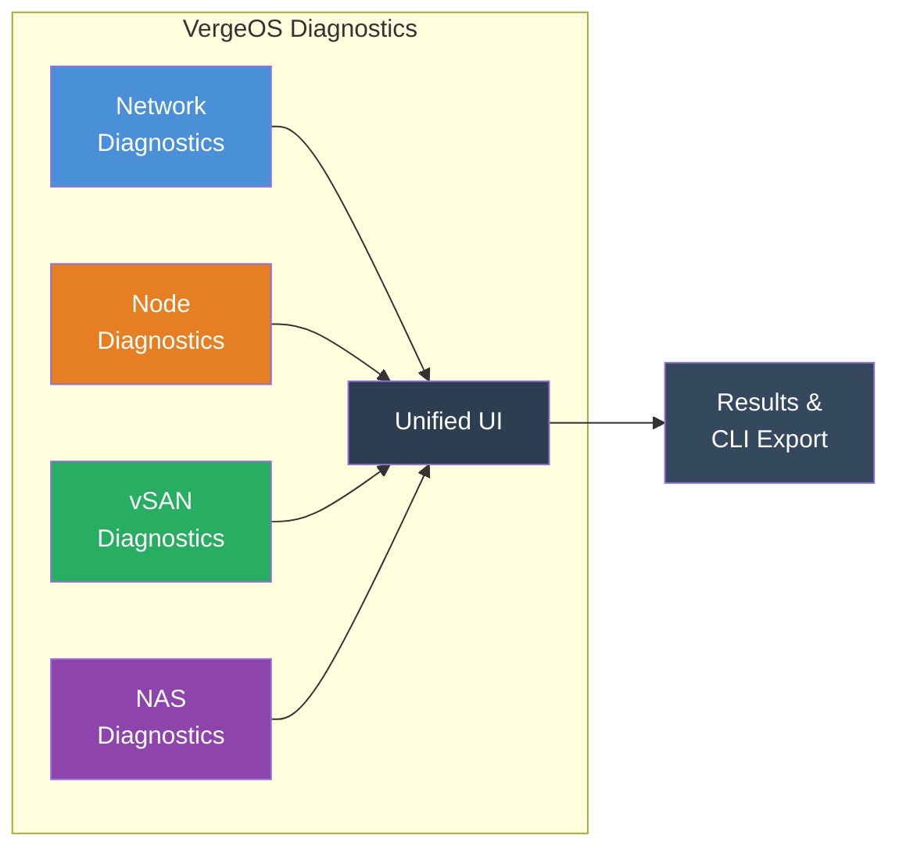
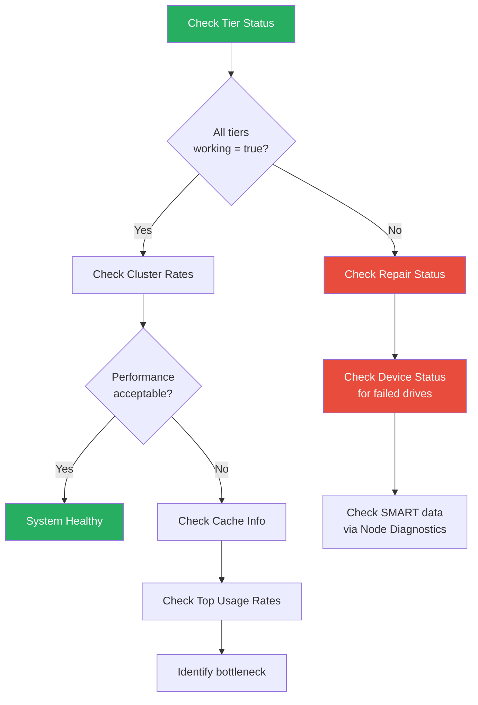
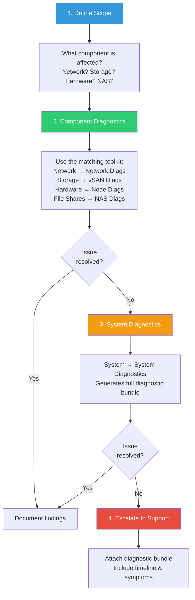

# Diagnostics Toolkit

## Four Diagnostic Toolkits in One Platform

VergeOS embeds diagnostic tools directly into every major subsystem. Rather than SSH-ing into individual nodes or installing third-party utilities, administrators run diagnostics from the **VergeOS UI** — each scoped to the component being investigated.

Every diagnostic interface follows the same pattern:

1. Navigate to the component (network, node, NAS, or vSAN)
2. Click **Diagnostics** in the left menu
3. Select a command from the **Query** dropdown
4. Configure parameters on the right
5. Click **Send →** to execute


**Show Command Toggle**

Enable **"Show Command"** on any diagnostic to see the exact command being executed. This is the authoritative way to view the underlying syntax for scripting, automation, or reproducing a command over SSH.


---

## Network Diagnostics

**Access:** Networks → [Select Network] → Diagnostics

Network diagnostics run **per-network** — you select the specific network you want to troubleshoot, and all commands execute within that network's context. This is critical because VergeOS networks are isolated by design.

### Connectivity & Discovery

| Command                 | Purpose                                            |
| ----------------------- | -------------------------------------------------- |
| **Ping**                | Basic ICMP connectivity test                       |
| **Trace Route**         | Map the network path to a destination              |
| **ARP Scan**            | Discover active devices on the network             |
| **ARP Table**           | View current IP-to-MAC mappings                    |
| **TCP Connection Test** | Verify a specific TCP port is reachable            |
| **What's My IP**        | Check the network's external IP (NAT verification) |

### DNS & Name Resolution

| Command        | Purpose                            |
| -------------- | ---------------------------------- |
| **DNS Lookup** | Query A, AAAA, MX, NS, PTR records |

### Firewall & Security

| Command                        | Purpose                               |
| ------------------------------ | ------------------------------------- |
| **Show Firewall Rules**        | Display the full firewall ruleset     |
| **Trace/Debug Firewall Rules** | Enable per-rule logging for debugging |
| **NMAP**                       | Port scanning and service discovery   |

### Traffic Analysis

| Command               | Purpose                           |
| --------------------- | --------------------------------- |
| **TCP Dump**          | Packet capture with BPF filtering |
| **Top Network Usage** | Real-time bandwidth consumers     |
| **Top CPU Usage**     | Processes consuming the most CPU  |

### Service-Specific

| Command                | Purpose                                         |
| ---------------------- | ----------------------------------------------- |
| **DHCP Release/Renew** | Force DHCP lease refresh (DHCP client networks) |
| **IPsec**              | Monitor and control IPsec VPN tunnels           |
| **FRRouting BGP/OSPF** | Dynamic routing protocol status                 |
| **Logs**               | Network container system logs                   |


**Tenant Access**

Tenants have access to their own network diagnostics for tenant-specific networks. These tools operate within the tenant's network scope — they cannot see parent-level networks.


---

## Node Diagnostics

**Access:** Infrastructure → Nodes → [Select Node] → Diagnostics

Node diagnostics provide **hardware-level** visibility into individual physical servers. These tools interact directly with the server's BMC, drives, and physical network interfaces.

### IPMI / BMC Tools

These commands communicate with the server's Baseboard Management Controller — the out-of-band management interface (iDRAC on Dell, iLO on HPE, etc.).

| Command                         | Purpose                               |
| ------------------------------- | ------------------------------------- |
| **IPMI BMC Info**               | BMC firmware and configuration        |
| **IPMI Chassis Status**         | Power state, intrusion detection      |
| **IPMI FRU Info**               | Field Replaceable Unit identification |
| **IPMI LAN Info**               | BMC network configuration             |
| **IPMI MC Reset**               | Reset a non-responsive BMC            |
| **IPMI Sensors**                | Temperature, voltage, fan readings    |
| **IPMI Sensor Data Repository** | Full sensor data repository           |
| **IPMI System Event Logs**      | Hardware event history (SEL)          |


**IPMI MC Reset**

Resetting the BMC temporarily disrupts out-of-band management. The host OS continues running — this only affects the management controller.


### Drive & Storage Health

| Command                        | Purpose                                                                |
| ------------------------------ | ---------------------------------------------------------------------- |
| **S.M.A.R.T. Information**     | Drive health attributes, wear, temperature                             |
| **S.M.A.R.T. Diagnostic Test** | Run short, long, or conveyance tests                                   |
| **Show Block Devices**         | List all block devices on the node                                     |
| **LED Control (Drive)**        | Activate/deactivate the drive's locate LED for physical identification |
| **RAS Query**                  | Memory ECC error reporting                                             |

### Network & Fabric

| Command                  | Purpose                                |
| ------------------------ | -------------------------------------- |
| **Ethernet Tool**        | Link speed, duplex, driver info        |
| **Fabric Configuration** | Core fabric status for this node       |
| **Network Bonding**      | Bond interface health and active slave |
| **Bridge Addresses**     | Virtual switch MAC address table       |
| **ARP Scan / ARP Table** | Node-level network discovery           |
| **Ping / Trace Route**   | Basic connectivity from node context   |

### System

| Command                      | Purpose                                            |
| ---------------------------- | -------------------------------------------------- |
| **DMI Table**                | Full hardware inventory (CPU, RAM, serial numbers) |
| **Logs**                     | System and kernel logs                             |
| **OpenSSL Speed**            | CPU crypto performance benchmark                   |
| **Clear Persistent Storage** | Clear filesystem caches (support use only)         |


**Coming from VMware or Nutanix?**

| Platform | Where deep hardware inspection happens |
| --- | --- |
| VMware | SSH/DCUI to the ESXi host for `esxcli`/`vsish`; vCenter exposes some SMART/sensors but deep work leaves the vSphere UI |
| Nutanix | Prism Element Hardware page + `ncli` from the CVM; IPMI/BMC accessed separately for drive LED and detailed sensors |
| VergeOS | Single node diagnostics panel: IPMI, SMART, drive LED control, fabric health, with no SSH or separate BMC credentials. "Show Command" reveals the underlying syntax. |


---

## vSAN Diagnostics

**Access:** System → vSAN Diagnostics

vSAN diagnostics operate at the **system level**, providing deep visibility into the distributed storage engine.


**Root / Parent Level Only**

vSAN diagnostics are only available at the root/parent level. **Tenants do not have access** to vSAN diagnostic tools — they interact with storage through their allocated virtual disks.


### Key vSAN Diagnostic Commands

| Command                    | Purpose                                       |
| -------------------------- | --------------------------------------------- |
| **Get Tier Status**        | Health, redundancy, and capacity per tier     |
| **Get Cluster Rates**      | Read/write throughput across the cluster      |
| **Get Cluster Usage**      | Overall storage utilization statistics        |
| **Get Device List**        | All storage devices in the vSAN pool          |
| **Get Device Status**      | Individual device health and error counts     |
| **Get Device Usage**       | Per-device capacity and I/O metrics           |
| **Get Repair Status**      | Active rebuild/repair progress                |
| **Get Journal Status**     | Write-ahead journal health                    |
| **Get Integ Check Status** | Data integrity verification progress          |
| **Get Cache Info**         | Cache hit/miss ratios and memory usage        |
| **Get File Status**        | Replication and integrity for a specific file |
| **Get Top Usage Rates**    | Identify top storage consumers                |
| **Get Running Conf**       | Current vSAN configuration parameters         |
| **Get Sync List**          | Active synchronization operations             |
| **Get Node List**          | All nodes participating in the vSAN           |
| **Integ Check**            | Initiate a full integrity check               |
| **Summarize Disk Usage**   | Cluster-wide disk usage summary               |

### vSAN Health Check Workflow

A structured approach to investigating storage issues:

### Key Indicators to Monitor

- **`working = false`** on any tier → Critical — tier is not operational
- **`redundant = false`** → Degraded state, no fault tolerance
- **`bad_drives > 0`** → Drive failure detected, auto-repair in progress
- **Repair status all zeros** → No active repairs (healthy state)
- **Write throttle active** → Storage capacity approaching limits (>91% triggers throttling)

### Storage Space Throttling Thresholds

| Utilization | Behavior                                         |
| ----------- | ------------------------------------------------ |
| **< 91%**   | Normal operation, no throttling                  |
| **91–95%**  | Low-space throttling begins (10ms latency added) |
| **96%+**    | Critical throttling (50ms latency added)         |
| **> 96%**   | Severe performance degradation                   |

---

## NAS Diagnostics

**Access:** NAS → [Select NAS Service] → Diagnostics

NAS diagnostics are **per-NAS-service** — each NAS instance has its own diagnostic interface. These tools focus on file-sharing protocols (SMB/CIFS, NFS) and authentication.

### File-Sharing & Authentication

| Command     | Purpose                                                                            |
| ----------- | ---------------------------------------------------------------------------------- |
| **Samba**   | SMB/CIFS service status — active connections and locked files, config validation, and share listing |
| **NFS**     | NFS service status — current exports, RPC registration, and client mount visibility |
| **Winbind** | Active Directory checks — domain trust relationship, domain users, and domain groups |

### Standard Network Tools

NAS diagnostics also include the standard connectivity tools: **Ping**, **Trace Route**, **ARP Scan/Table**, **TCP Dump**, **TCP Connection Test**, **DNS Lookup**, **NTP Query**, **Top CPU Usage**, **Top Network Usage**, and **Logs**.

### User & Group Diagnostics

| Command       | Purpose                              |
| ------------- | ------------------------------------ |
| **Users**     | System user accounts                 |
| **Groups**    | System groups and membership         |
| **Date/Time** | Time sync (critical for Kerberos/AD) |
| **Services**  | All running services                 |

---

## Best Practice Troubleshooting Workflow

When investigating an issue, follow a structured escalation path from component-specific diagnostics to system-wide analysis:

### Workflow Guidelines

1. **Start simple** — Ping before packet capture. Check tier status before integrity checks.
2. **Scope correctly** — Select the right network, node, or NAS service before running diagnostics. Running commands in the wrong context produces misleading results.
3. **Document as you go** — Use "Show Command" to capture exact commands. Copy output before moving to the next test.
4. **Consider performance impact** — TCP Dump, NMAP scans, and integrity checks can affect production performance. Schedule intensive diagnostics during maintenance windows.
5. **Check logs last** — Logs provide context but can be overwhelming. Use targeted diagnostics first, then correlate with log entries.

### System Diagnostics Bundle

For issues that span multiple components or require support escalation, VergeOS can generate a **full diagnostic bundle**:

- **Access:** System → System Diagnostics
- **Output:** `[SYSTEMNAME]_diags_[YYYYMMDD]_[HHMMSS].tar.gz`
- **Contents:** vSAN status files, SMART reports, network configuration, IPMI data, system logs, and kernel logs — organized per-node
- **Bundle storage:** Saved as a `files` record in vSAN; the bundle persists until you delete it


**UI Log Retention vs. Bundle Retention**

The diagnostic bundle itself has no automatic expiration. Separately, VergeOS retains live UI **system logs for 45 days** before automatic deletion — configure remote syslog forwarding if you need longer log history.



**Before Escalating**

Always generate a fresh System Diagnostics bundle before contacting support. This provides a complete point-in-time snapshot that support engineers can analyze without needing live system access.


---

## Quick Reference: Which Toolkit to Use

### Network Diagnostics

**Use when:** VM can't reach the internet, DNS not resolving, firewall blocking traffic, DHCP not assigning IPs, VPN tunnel down

**Access:** Networks → [Network] → Diagnostics

### Node Diagnostics

**Use when:** Hardware alerts, drive failures, temperature warnings, NIC link issues, IPMI unresponsive, fabric connectivity problems

**Access:** Infrastructure → Nodes → [Node] → Diagnostics

### vSAN Diagnostics

**Use when:** Storage performance degraded, tier unhealthy, capacity warnings, repair stuck, data integrity concerns

**Access:** System → vSAN Diagnostics

### NAS Diagnostics

**Use when:** SMB shares inaccessible, NFS mount failures, AD authentication broken, file permission denied, slow CIFS performance

**Access:** NAS → [NAS Service] → Diagnostics
