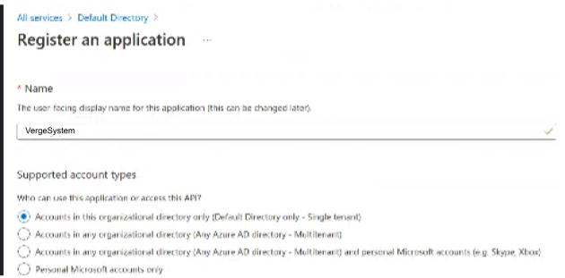
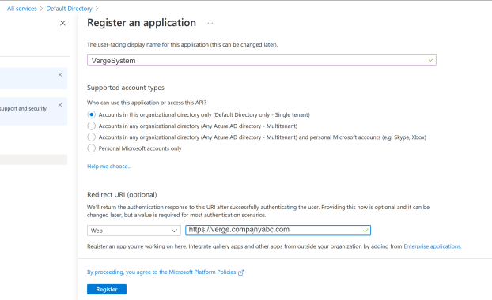
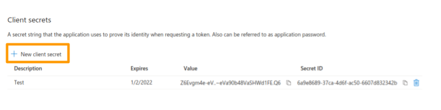
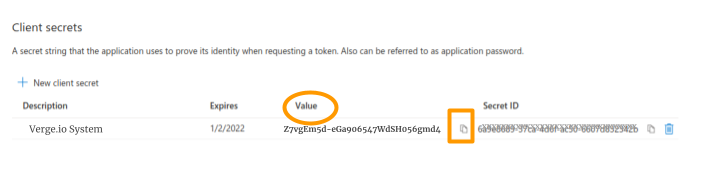
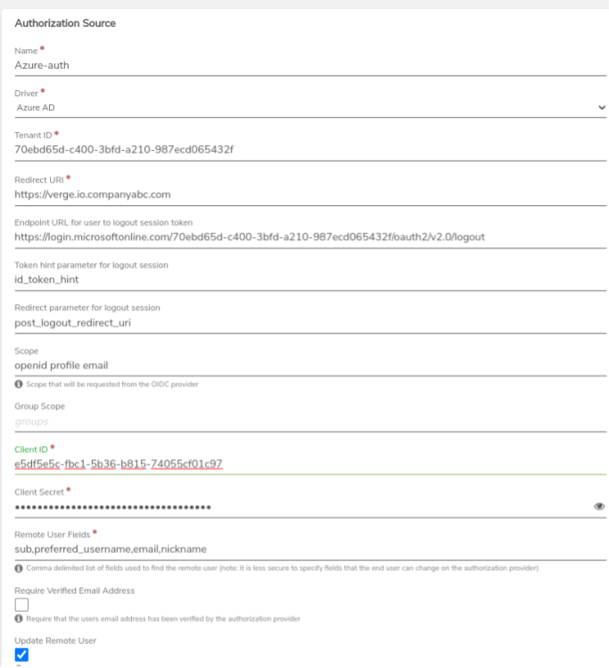
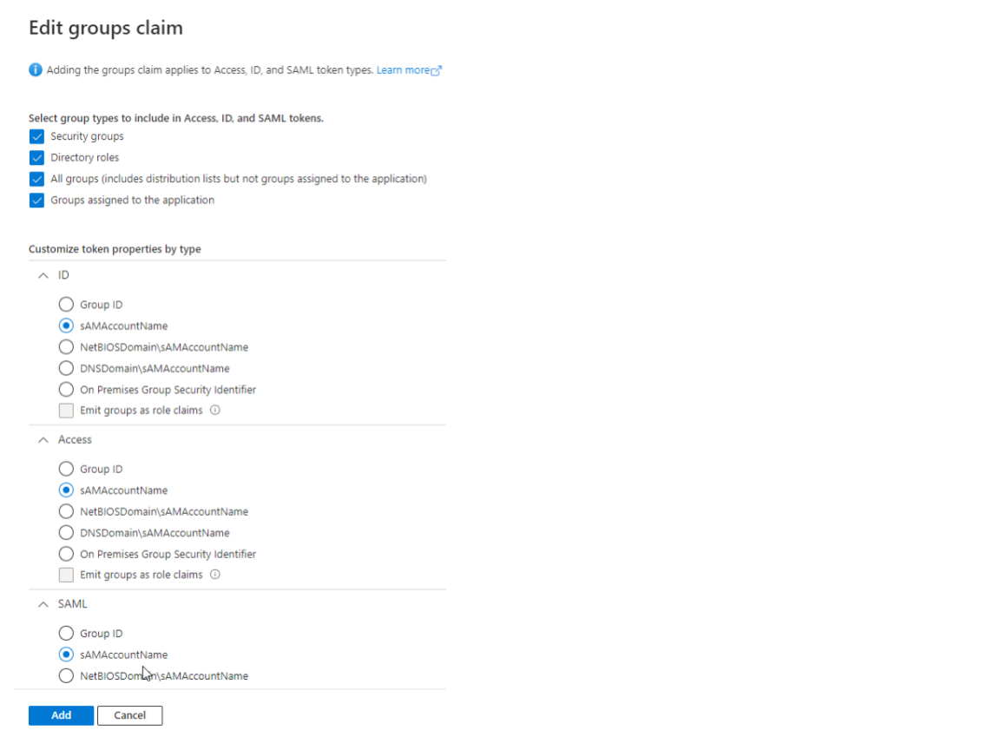
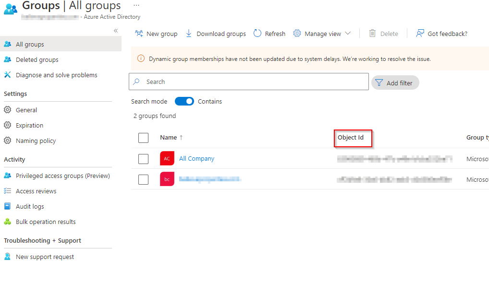
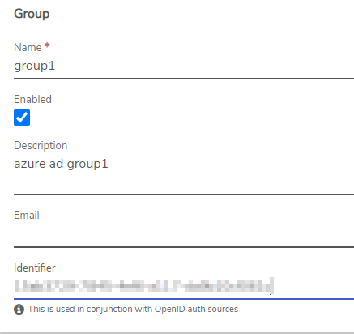
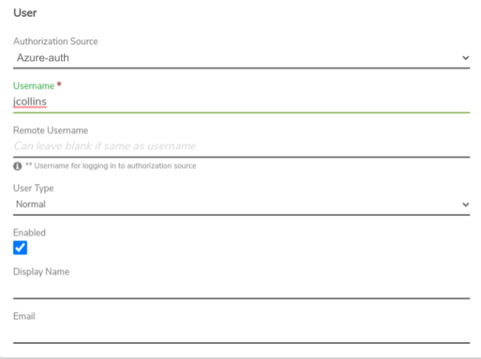

# Using Entra ID (Azure AD) for Authentication

VergeOS can be configured to allow users to authenticate using their corporate Azure credentials. This page will walk you through the configuration process.

## Configure an Entra ID Authorization Source

1.  In Azure services: register a single-tenant web application, setting the _**Redirect URI**_ to the URL of the VergeOS system and creating a new client secret. **Azure Active Directory > App Registrations > New Registration** 

    
2.  Create a new client secret. **App Registrations > Client Credentials > Add a certificate or secret. Click +New client secret.**

    * Enter a **description and expiration date** for the new client secret.
    * **Obtain the following from Azure** to be used in configuration of the authorization source within VergeOS:
      * **Tenant ID** - **hint:&#x20;**_**All services > Azure Active Directory > Overview.**_**&#x20;The Tenant ID is listed under Basic Information.**
      * **Client ID** - **hint:&#x20;**_**Azure App Registrations > Configured Item > Client Credentials**_
      * **Client Secret** - **hint:&#x20;**_**Azure App Registrations > Configured Item > Client Credentials**_**&#x20;Use the "VALUE" field.**

     
3. Click **System** on the top menu.
4. Select **Auth Sources**.
5. Click **New** on the left menu.
6. Enter a _**Name**_ for the source (such as "Azure"). This name will appear on the sign-in button of the VergeOS login page. 
7. In the _**Driver**_ field (dropdown list), select **Azure AD**.
8. Enter the _**Tenant ID**_ obtained in the previous step.
9. The _**Redirect URI**_ should be the URL to your VergeOS system (for ex: https:/\[]/verge.io.mycompanyabc.com)
10. Enter _**Endpoint URL for user to logout session token**_ (https:/\[]/login.microsoftonline.com/_**TENANTID**_/oauth2/v2.0/logout)
11. _**Scope**_ should typically be left at the default value: "OpenID profile email".
12. _**Group Scope**_ needs to be set if users should be auto-created based on group membership; typically, this is set to the word "groups" with no punctuation.
13. Enter the _**Client ID**_ obtained in the previous step.
14. Enter the _**Client Secret**_ obtained in the previous step.
15. _**Remote User Fields**_ defines the list of fields used to initially find the Azure user; this field is auto-populated with (sub,preferred\_username,email nickname), a default list that can typically work for most implementations. **Note: For security reasons, it is not recommended to locate remote users based on fields that are changeable by the end user on the remote system.**
16. To carry over group membership from Azure to VergeOS, check the _**Update Group Membership**_ checkbox. Groups must be created in VergeOS using instructions below.
17. **User Auto-Creation Features (optional)**: Users can be auto-created upon initial login to VergeOS; this can be selected for all Entra ID users -OR- limited to users in specified Entra ID groups.
    * _**Auto-Create Users**_ - If all users should be auto-created, enter `.*` here.
    * _**Auto Create Users in Group**_ - To only auto-create users that are members of specified Entra ID groups, enter the group object ID(s) in regular expression (regex) form.


**Auto Creating Users in Groups**

* The **Group Scope** must be defined. (Group Scope field defined above)
* **Token Configuration** must be set up in Entra ID (instructions below).
* Entra ID **groups** specified for Auto Create **must be created on the VergeOS side** (instructions below).
* To auto-create based on group, the _**Auto Create Users**_ **field must be blank**
* Multiple specific group IDs can be entered using the format: (ID)|(ID)|(ID)


18. **Options (recommended enabled):**

* _**Update Remote User:**_ - once the user is located in Entra ID, update VergeOS user _Remote Username_ field to the corresponding Azure unique ID.


**Enabling the Update Remote User will allow the VergeOS system to store the unique Azure ID in the VergeOS user record (after initially locating the Entra ID user with fields defined in Remote User Fields), so the unique identifier can subsequently be used for finding the Entra ID user; this is typically recommended since fields such as email address are subject to change.**


* _**Update User Email Address:**_ - Update VergeOS user email address to match email address within Entra ID.
* _**Update User Display Name:**_ - Update VergeOS user display name to match display name within Entra ID.
* _**Update Group Membership:**_ - Update the groups that a VergeOS user is a member of. (A Group Scope is required for this to function.)

19. **Additional Optional Fields:** See [**Authorization Sources (General)**](auth-sources-overview.md) for information regarding additional optional Fields.

## Add Azure Groups to VergeOS

Interfacing with Azure groups requires a token on the Entra ID app registration and creation of groups in VergeOS:

### Set up a Token Configuration in Entra ID

1. Navigate to the **App registration page** for the App created above.
2. Click on **Token Configuration** on the left menu and click **+Add groups claim**.
3. Check the appropriate **group types**.
4. Set the **ID, Access, and SAML to sAMAccountName**.

### Steps to Add Azure Groups

1. Navigate to **System > Groups.**
2. Click **New** on the left menu.
3. Enter the group _**Name**_ to match the group name in Entra ID.
4. Optionally, an _**Email**_ can be entered for the group. This email address is used for sending subscription alerts and/or reports assigned to the group.
5. Copy the coordinating **Object Id** from the Groups/All Groups page in Entra ID to the _**Identifier**_ field.
6. Click **Submit** (bottom of the page) to save the new group.

## Manually Add Users from Azure

After the Azure auth source is created, users can be manually created in VergeOS to utilize the authorization source for login authentication. Manually creating users is only necessary when users are not configured to be auto-created.

### Add VergeOS Users that will use Entra ID Auth

When creating the new user, use the following configuration:

* _**Authorization Source:**_ Select the Entra ID source from the dropdown list
* _**Username:**_ unique name within the VergeOS system; typically it is recommended to use the Azure principal name.
* _**Remote Username:**_ use value of one of the fields defined as _Remote User fields_ these are fields that are searched on in Azure (e.g. username, email)
* _**Display Name:**_ (optional) If _Update User Display Name_ is enabled on the Entra ID auth source, display name will automatically synchronize from Entra ID.
* _**Email Address:**_ (optional) If _Update User Email Address_ is enabled on the Entra ID auth source, email address will automatically synchronize from Entra ID.

