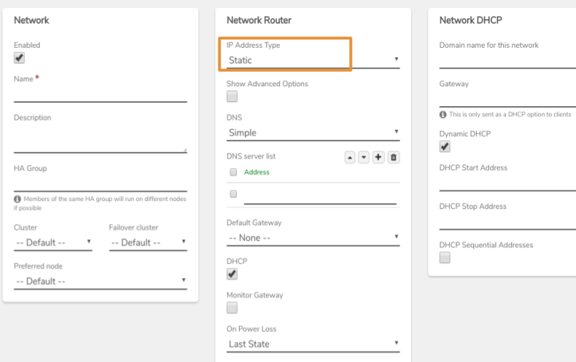

# Creating an Internal Network managed within VergeOS (layer3)

Internal networks can be created as Layer2 or Layer3. To create a layer3 internal network, in which DHCP, DNS, firewall, routing and throttling can be managed within VergeOS, select _**Static**_ in the **IP Address Type** field.

Full instructions for creating a layer3 internal network can be found at: [**Internal Networks (General Instructions)**](internal-networks.md).
