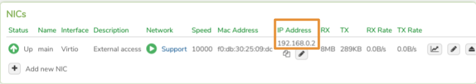
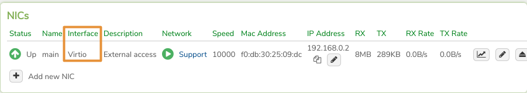
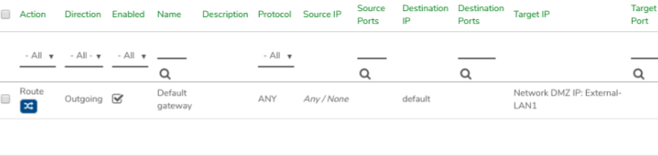
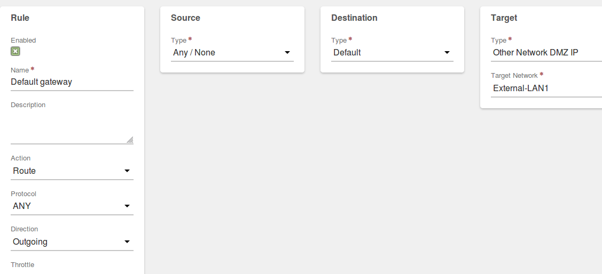
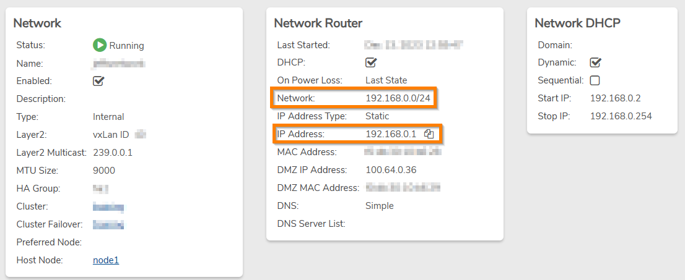

# Network Troubleshooting

This page contains common network testing/troubleshooting steps.

## Ping tests within a VM (test network connectivity/DNS)

1. **ping `google.com`**
   * A ping reply indicates Internet connectivity; if problems were reported; gather more detailed information, such as specific sites that were not accessible, in order to troubleshoot further.
   * If no ping reply: Continue with the next ping test.
2. **ping 8.8.8.8**
   * A ping reply indicates Internet connectivity. If there was a reply here but no reply from the test above (google.com), investigate [DNS](net-troubleshooting.md#dns).
   * If no ping reply: run the next ping test to check the VM connection to the network router.
3. **Ping the network router address.**\
   To check a network's addressing, see: [Determine Network Addresses](net-troubleshooting.md#determining-network-addresses)
   * A ping reply indicates the VM is connecting to the network; if the VM receives a ping reply here, but is unable to reach the Internet (failed the above ping tests): see the [Common Network Diagnostics](net-troubleshooting.md#common-network-diagnostics) section to investigate issues with the network.
   * If no Ping reply: continue testing the VM configuration below.

## Verify VM has Appropriate IP Address


**By default, an internal VergeOS network is configured to serve DHCP addresses.**


**Check if the VM received a DHCP address:**

1. Navigate to the **VM Dashboard**.
2. Scroll down to the **NICs** section of the screen. If the network assigned a DHCP address to the NIC, it will display in the **IP Address** field. 
3. **If an IP address was manually assigned within the guest OS (rather than utilizing DHCP):** -Verify assigned IP address lies within the network's address range.


**Default addressing for a Layer3 internal network: network segment: 192.168.0.0/24; router address: 192.168.0.1 To check a network's addressing, see** [**Determining Network Addresses**](net-troubleshooting.md#determining-network-addresses)


4. Verify appropriate subnet mask and gateway (gateway should be network router IP address).
5. Verify the IP address is not duplicated (in use by another NIC) on the same network.


**It is typically recommended to use DHCP on internal networks, rather than simply assigning addresses within the VM guest OS. Static DHCP can be configured to reserve particular addresses to particular VMs:** [**Create a DHCP Static Entry**](dhcp-static-lease.md)


## Verify Correct NIC Interface and Driver

VirtIO is generally the recommended interface for NIC devices, as it typically will provide the best performance. VirtIO drivers may need to be added for Windows VMs. VergeOS custom Windows ISO files include VirtIO drivers and can be used for initial guest OS installation; otherwise, the latest VirtIO drivers can be downloaded at: https://fedorapeople.org/groups/virt/virtio-win/direct-downloads/stable-virtio/virtio-win.iso

**Check the NIC interface:**

1. Navigate to the **VM Dashboard**.
2. Scroll down to the **NICs** section of the screen.
3. The **Interface** column will display for each NIC. 

## Check Guest Firewalls and AV software

If a VM is still unable to reach its network router after the NIC interface/driver and IP addressing have been verified, check guest software such as OS firewalls, antivirus programs, etc. that can block outgoing access. Consult associated help menus/documentation for these products for configuration instructions.

## Common Network Diagnostics

Some common network diagnostic queries are explained within this section; see [**Network - Diagnostics**](network-diagnostics.md) for additional information regarding the built-in diagnostics tool.

### Check that a Network has Internet Connectivity

1. Navigate to the network dashboard.


**A quick way to navigate to the network on which a NIC is connected: from the VM Dashboard, scroll down to the NICs section and click on the network listed for the NIC.**


2. Click **Diagnostics** on the left menu.
3. Select _**Ping**_ from the **Diagnostics Query** dropdown list.
4. Click **Send** to test a ping to 8.8.8.8 (This is the default Host value; it is Google's Public DNS.)
5. An unsuccessful ping may indicate an incorrect network configuration.
6. If the ping test is successful; you can test further to verify DNS is working properly; change the **Host** value to an Internet DNS name (e.g. google.com) and click **Send**

## Default Gateway Rule

In order for an internal network to receive Internet connectivity, it must have a default gateway rule to route through an external network.

**Check the Default Gateway Route Rule:**

1. Navigate to the network dashboard.
2. Click **Rules** on the left menu.
3. Verify there is a route rule with the appropriate external network defined as the Target.\
   Example: 


**When creating a new internal network, select the external network in the Default Gateway setting; this will automatically create the needed default gateway route rule. A route rule can also be manually created after network creation, using the following instructions.**


**Create a Default Gateway Route Rule:**

1. Navigate to the network dashboard.
2. Click **Rules** on the left menu.
3. Click **New** on the left menu.
4. Enter a **Name** for the rule (recommended name: "Default Gateway").
5. In the **Action** field, select _**Route**_.
6. In the **Direction** field, select _**Outgoing**_.
7. In the **Type** (Target) field, select _**Other Network DMZ IP**_.
8. In the **Target Network** field, select the appropriate external network.

Example: 

## Determining Network Addresses

A network's gateway address and network segment can be found on the network dashboard.

* **Network**: network segment in CIDR format (ex: 192.168.0.0/24; 10.10.0.0/24)
* **IP Address**: network router address (ex: 192.168.01; 10.10.0.1)


**By default, internal layer-3 networks are configured with network segment: 192.168.0.0/24 and router IP Address: 192.168.0.1**


## DNS

### Test DNS on a Network

1. Navigate to the network's dashboard.
2. Click **Diagnostics** on the left menu.
3. Select _**DNS Lookup**_ in the **Query** dropdown list.
4. Default values can be used to run a basic DNS test. Values can be changed if needed:
   * **Host** (URL)
   * **Query Type** (record type)
   * **DNS Server** (optional, use to specify particular DNS server, overriding default)
5. Click **Send** to submit the query.
6. The Responses window will show the result; a successful DNS lookup will return the corresponding IP address for the entered Host.

### Test DNS from a VM

When a VM is able to reach Internet IP addresses but not URL addresses, a DNS problem is indicated. If DNS function is validated from the network, but not from the VM itself, check DNS configuration within the VM guest OS; DNS lookup tests that can be performed will vary per guest OS version (nslookup, dig, etc.)


**If the VM is configured with DHCP and successfully receiving an address it will also automatically receive DNS configuration from the network**


For Additional Troubleshooting help, contact VergeOS Support.
