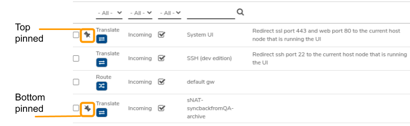

# Network Rules

Rules define behavior for incoming and outgoing traffic in a network, providing the functionality traditionally provided by firewalls, routers, and switches.

## Rule Types

### Firewall (action = Accept/Drop/Reject)

Allows controlling the network's traffic by filtering both input and output packets - only allowing packets to pass through if matching established rules. These rules are typically related to securing the network.

### NAT/PAT (action = Translate)

Provides Network Address/Port Translation - commonly used to conserve external/internal IP addresses by translating public addresses through to private IP addresses. NAT/PAT also allows "hiding" true addresses of network computers, with the translation of external IP/port to internal address/port which can also provide security aspects.

### Static Routes (action=Route)

Allows controlling traffic paths from the network. A common use would be to provide a default gateway which allows routing traffic out of a private network through an external network for Internet access.

## Order of Rules

Rules are processed from the top of list to the bottom. There are situations where the order in which rules are processed can change behavior For example: a NAT/PAT rule to translate incoming traffic to a different port, while another rule that blocks traffic based on port; there could be different results depending upon which rule runs before the other. Therefore, it may be important to consider the order of your network rules. See the instructions below to _Change the Order of Rules_.

## View Existing Rules for a Network

A network's rules can be accessed by:

From the network's dashboard, click **Rules**. All existing rules for the network are listed.

!!! success "To access a particular network's dashboard: Navigate to **Networks** > **List**-OR- Navigate to **Networks** > **Dashboard**, **click on the network-type card (Externals/Internals/Tenants/VPN)** , locate and double-click the target network in the list.

For long rule lists, it may be helpful to filter the list (e.g. display Incoming only; only Reject rules, etc) or search on specific criteria such as Name, assigned IP, etc.

## Create a New Firewall Rule (to explicitly allow or deny particular traffic)

1. From the network's dashboard, click **Rules**.
2. Click **New** on the left menu.


**These instructions detail how to create a new rule from scratch; new rules can also be created by making a copy of an existing rule, and changing any settings necessary; see instructions below to&#x20;**_**Create a new Rule based on an existing Rule**_


3. Enter a **Name** for the new rule. (Name should be something helpful for future administration.)
4. Optionally enter a **Description** for the rule.
5. Select _**Accept/Drop/Reject**_ from the **Action** dropdown list.
   * _**Accept:**_ allow packets through that meet the defined criteria
   * _**Drop:**_ do not allow packets that meet the defined criteria
   * _**Reject:**_ do not allow specified traffic and send ICMP destination unreachable back to the source, when permitted
6. Optionally specify the _**Connection Tracking State**_
7. Select _**Protocol**_ from the **Protocol** dropdown list. (_**ANY**_ option will apply this rule to all protocols.)
8. Select _**Incoming**_ or _**Outgoing**_ from the **Direction** dropdown list.
9. Select a specific _**Interface**_ or _**Any**_ from the **Interface** dropdown menu.
10. Optionally pin the rule to the _**Top**_ or _**Bottom**_ of the rules list.
11. Select **Enable Throttle** to set a traffic rate limit.
12. The **Track Rule Statistics** checkbox can be selected to amass totals of the traffic that is processed through this rule. See [**Tracking Network Statistics**](tracking-net-statistics.md) for more information.
13. Select **Trace/Debug Rule** to be able to trace packets for diagnostic purposes.
14. Select **Source** (where traffic comes from) and **Destination** (where traffic is addressed to go) and **Target** (target IP for _**Route**_ and _**Translate**_ **Actions**) from the dropdown list:
    * _**Alias:**_ to select an Alias IP defined on this network
    * _**Any/None:**_ any source address; no filter on source address
    * _**Custom:**_ provides a text input field where a specific filter can be entered. Custom entries can include individual IP address(ex: 192.168.1.200), CIDR network(ex: 10.10.4.0/28), or IP range(ex: 192.168.1.50-192.168.1.100)
    * _**My IP Addresses:**_ helper option to select an IP address defined on this network (from virtual IPs, static IPs, IP Aliases)
    * _**Default:**_ (destination/route rule) - helper option, defines default route
    * _**My Network Address:**_ helper option, to use this network (entire segment)
    * _**My Router IP:**_ helper option to use this network's IP address (single IP address)
    * _**Other IP Address:**_ helper option, to select a different network and one of that network's particular addresses
    * _**Other Network Address:**_ helper option, to select a different network and use that network's address (entire segment)
    * _**Other Router IP:**_ helper option, to select a different network and use that network's IP address (single IP address)
    * _**Other Network DMZ IP:**_ helper option, to select the DMZ IP address of another network


**Any specific IP address or network can be entered by using the&#x20;**_**Custom**_**&#x20;option; however, it is typically best to use one of the above helper options to select a variable setting that automatically handles inputting the correct address information. Using a helper option rather than specifying static addresses will allow the rule to continue working even when specific addresses are modified within VergeOS Networks and allows for efficient cloning and recipe templates that include these network rules.**


15. Click **Submit** to save the new rule.

## Create a Route or Translate (NAT/PAT) Rule

1. From the network's dashboard, click **Rules** on the left menu.
2. Click **New** on the left menu.


**These instructions detail how to create a new rule from scratch; new rules can also be created by making a copy of an existing rule, and changing any settings necessary; see instructions below to Create a new Rule based on an existing Rule**


3. Enter a **Name** for the new rule. (Name should be something helpful for future administration.)
4. Select _**Route**_ or _**Translate**_ from the **Action** dropdown list:
   * _**Route:**_ to define a routing rule
   * _**Translate:**_ to define a rule that maps an address/port outside this network with an address/port within this network
5. Select _**Protocol**_ from the **Protocol** dropdown list to apply this rule only to specific protocols. Select _**ANY**_ to apply this rule to all protocols
6. Select _**Direction**_ from the **Direction** dropdown list (_**Incoming**_ or _**Outgoing**_)
7. Optionally pin the rule to the _**Top**_ or _**Bottom**_ of the rules list.
8. The **Track Rule Statistics** checkbox can be selected to amass totals of the traffic that is processed through this rule. See [**Tracking Network Statistics**](tracking-net-statistics.md) for more information.
9. Select **Trace/Debug Rule** to be able to trace packets for diagnostic purposes.
10. Select **Source** (where traffic comes from), **Destination** (where traffic is addressed to go), and **Target** (where to actually direct the traffic):
    * _**Alias:**_ to select an Alias IP defined on this network
    * _**Any/None:**_ any source address; no filter on source address
    * _**Custom:**_ provides a text input field where a specific filter can be entered (individual IP address; CIDR network, IP range) ex: 192.168.0.55; 10.10.10.0/24; 192.168.0.20-192.168.0.30
    * _**Default:**_ (destination/route rule) - defines default route
    * _**My IP Addresses:**_ to select an IP address defined on this network (from virtual IPs, static IPs, IP Aliases)
    * _**My Network Address:**_ to use this network (entire segment)
    * _**My Router IP:**_ to use this network's IP address (single IP address)
    * _**Other IP Address:**_ to select a different network and one of that network's particular addresses
    * _**Other Network Address:**_ to select a different network and use that network's address (entire segment)
    * _**Other Router IP:**_ to select a different network and use that network's IP address (single IP address)
    * _**Other Network DMZ IP:**_ to select the DMZ IP address of another network


**Any specific IP address or network can be entered by using the&#x20;**_**Custom**_**&#x20;option; however, it is typically best to use one of the above helper options to select a variable setting that automatically handles inputting the correct address information. Using a helper option rather than specifying static addresses will allow the rule to continue working even when specific addresses are modified within VergeOS Networks and allows for efficient cloning and recipe templates that include these network rules.**


11. Specify ports/ranges in **Source/Destination/Target Ports/Ranges** (only applies to TCP/UDP protocols). Ports can be individual ports (with multiple individual ports separated by commas ex: 8080,8088) and port ranges ex: 1000-1005
12. Click **Submit** to save the new rule.

## Create a New Rule Based on an Existing Rule

1. From the network's dashboard, click **Rules**.
2. Select the rule from the list and click the copy icon on the far right of the selected line.
3. The new rule **Name** will default to the name of the source rule with "(copy)" appended to the end. Change the name to something helpful for future administration.
4. Fields are pre-populated with the values of the source rule, alter as needed for the new rule.
5. When fields are changed as needed, click **Submit** to save the new rule.

## Modify Existing Network Rule

1. From the network's dashboard, click **Rules**.
2. Select the rule from the list and click **Edit** on the left menu.
3. Make changes and click **Submit**.
4. Click **Apply Rules** on the left menu to put the change into effect.

## Pin a Firewall Rule to Top or Bottom


**Rule processing order is from top to bottom**


1. From the network's dashboard, click **Rules**.
2. Select the rule to pin.
3. Click **Edit** on the left.
4. In the **Pin** field, select _**Top**_ (to pin to the top of the un-pinned list) or _**Bottom**_ (to pin to the very end of the list)
5. Click **Submit** to save the change.
   * A right-side-up pin icon indicates the rule is pinned to the top
   * An upside-down pin icon indicates the rule is pinned to the bottom 

## Change the Order of Rules


**Rule processing order is from top to bottom**


1. From the network's dashboard, click **Rules**.
2. **Select the rule(s) to move up in the list.** (Make sure the desired rules are checked on the left.)
3. Determine the rule the selected ones should be moved above (meaning the selected rules should execute before this one) and click the move icon on that line. The selected rules are moved up the list.
4. Continue this process until all are in the desired sequence.
5. Click **Apply Rules** on the left menu to put the changes into effect.


**Rule changes are put into place after you&#x20;**_**Apply Rules**_**&#x20;(left menu option) or otherwise, the next time the network is restarted.**

