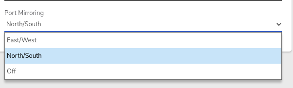

# Port Mirroring

Port mirroring replicates a network's traffic to a VM NIC, allowing packet analysis for monitoring or diagnostics.

## Configure Port Mirroring

1. Enable **Port Mirroring** in the network settings. 
   * Select _**North/South**_ to copy packets that traverse the network router
   * Select _**East/West**_ to copy packets that traverse the router AND all intranetwork packets


_**East/West**_**&#x20;port mirroring is typically only recommended as a temporary setting for diagnostics purposes; using it for long durations can impact performance as it replicates all network traffic.**


2. Click **Submit** to save the change.
3. Click **Restart** on the left menu to boot the network.
4. Create a VM that will be used for port analysis (or use an existing VM).
5. [**Add a NIC to the VM**](../virtual-machines/vm-nics.md):
   * In the **Network** field, select: _NETWORKNAME_\_mirror
   * Click **Submit** (bottom of page) to save
6. (Re)boot the VM.
7. Operating system/application software of choice can be used in the VM for packet analysis.
